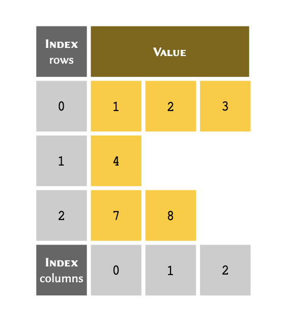

[**Download Chapter PDF (.pdf)**](https://drive.usercontent.google.com/u/1/uc?id=1-VvkJhmjX_LquWR92pioBOhvzTVG6hkc&export=download)

[**Download Chapter notebook (.ipynb)**](https://drive.usercontent.google.com/u/1/uc?id=1s-msBWdPEKJSepD-dYsRDXXsMmpL2X8v&export=download)

[<span style="color: rgb(255, 0, 0);">**Lesson Feedback Survey**</span>](https://docs.google.com/forms/d/e/1FAIpQLSdr0capF7jloJhPH3Pki1B3LZoKOG16poOpuVJ7SL2LkwLHQA/viewform?pli=1)

```{r setup, include=FALSE}
library(reticulate)

# Unset any previously set Python environments to avoid conflicts
Sys.unsetenv("RETICULATE_PYTHON")

# Check if Pandoc is available
if (!file.exists("/opt/homebrew/bin/pandoc")) {
  stop("Pandoc is not found. Please install Pandoc or update the path.")
}

# Dynamically set the Python environment
tryCatch({
  use_virtualenv("/Users/Adam/.virtualenvs/r-reticulate", required = TRUE)
  cat("Python environment set successfully.\n")
}, error = function(e) {
  cat("Error setting Python environment:", e$message, "\n")
  stop("Failed to set Python environment.")
})

# Validate Python environment
tryCatch({
  py_config()
  py_run_string("import numpy")  # Check for numpy availability
  cat("Python environment and numpy are correctly configured.\n")
}, error = function(e) {
  cat("Error in Python environment configuration or numpy check:", e$message, "\n")
  stop("Failed to validate Python environment.")
})

# Configure knitr chunks to ensure Python code is executed correctly
knitr::opts_chunk$set(
  eval = TRUE,    # Execute the code chunks
  echo = TRUE,    # Display the code chunks in the final output
  message = FALSE,  # Suppress messages from being shown
  warning = FALSE,  # Suppress warnings from being shown
  results = 'asis',  # Ensure output is handled properly
  engine = "python"  # Use Python engine for relevant chunks
)

cat("Setup chunk complete.\n")
```

:::::::::::::::::::::::::::::::::::::: questions

- What are the different types of arrays?
- How is data stored and retrieved from an array?
- What are nested arrays?
- What are tuples?

::::::::::::::::::::::::::::::::::::::::::::::::

::::::::::::::::::::::::::::::::::::: objectives
- Understanding difference between lists and tuples.
- Understanding operations on arrays.
- Storing multidimensional data.
- Understanding the concepts of mutability and immutability.
::::::::::::::::::::::::::::::::::::::::::::::::

<br>
<p align = "center">
<iframe width="560" height="315" src="https://www.youtube.com/embed/RlhGPZv8fZI" title="YouTube video player" frameborder="0" allow="accelerometer; autoplay; clipboard-write; encrypted-media; gyroscope; picture-in-picture" allowfullscreen></iframe>
</p>
<br>
<p align = "center">
<iframe width="560" height="315" src="https://www.youtube.com/embed/KiMQiN4CN8s" title="YouTube video player" frameborder="0" allow="accelerometer; autoplay; clipboard-write; encrypted-media; gyroscope; picture-in-picture" allowfullscreen></iframe>
</p>
<br>
<p align = "center">
<iframe width="560" height="315" src="https://www.youtube.com/embed/id72qTBmCEY" title="YouTube video player" frameborder="0" allow="accelerometer; autoplay; clipboard-write; encrypted-media; gyroscope; picture-in-picture" allowfullscreen></iframe>
</p>
<br>

:::::::::::::::::: prereq
- [Variables and Types](02-input_output.Rmd#varTypes)
- [Logical Operations](02-input_output.Rmd#subsec:logicalOperatons)
- [Conditional Statements](03-conditional_statements.Rmd)


::::::::::::::::::

<p style='text-align: justify;'>
So far, we have been using variables to store individual values. In some circumstances, we may need to access multiple values in order to perform operations. On such occasions, defining a variable for every single value can become very tedious. To address this, we use **arrays**.
</p>

<p style='text-align: justify;'>
Arrays are variables that hold any number of values. Python provides three types of built-in arrays. These are: ```list```, ```tuple```, and ```set```. There are a several common features among all arrays in Python; however, each type of array enjoys its own range of unique features that facilitates specific operations.
</p>

:::::::::::::::::::::::::::::::::::: callout
## Remember
Each item inside an array may be referred to as an *item* or a *member* of that array.

::::::::::::::::::::::::::::::::::::

## Lists
[**Resource for Lists**](https://docs.python.org/3/tutorial/datastructures.html\#more-on-lists)

<p style='text-align: justify;'>
Lists are the most frequently-used type of arrays in Python. It is therefore important to understand how they work, and how can we use them, and the features they offer, to our advantage.
</p>

<p style='text-align: justify;'>
The easiest way to imagine how a ```list``` works, is to think of it as a table that can have any number of rows. This is akin to a spreadsheet with one column. For instance, suppose we have a table with four rows in a spreadsheet application, as follows:
</p>


The number of rows in an array determines its *length.* The above table has four rows; therefore it is said to have a *length* of 4.


### **Implementation**

:::::::::::::::::::::::::::::::::::: callout
## Remember
In order to implement a ```list``` in Python, we place values into this list and separate them from one another using commas inside **square brackets**:  <span style="color: rgb(32, 121, 77);">list = [1,2,3]</span>.

::::::::::::::::::::::::::::::::::::

```{python}
table = [5, 21, 5, -1]

print(table)

```


```{python}

print(type(table))

```

::::::::::::::::::::::::::::::: challenge

## Practice Exercise 1 {#diy:array:list:fibonacci}

Implement a ```list``` array called <span style="color: rgb(32, 121, 77);">fibonacci</span>, whose members represent the first 8 numbers of the [Fibonacci sequence](https://en.wikipedia.org/wiki/Fibonacci_number) as follows:

| FIBONACCI NUMBERS (FIRST 8) |   |   |   |   |   |    |    |
|:---------------------------:|:---:|:---:|:---:|:---:|:---:|:---:|:---:|
| 1 | 1 | 2 | 3 | 5 | 8 | 13 | 21 |


::::::::::::::::: solution

## ANSWER

```{python}
fibonacci = [1, 1, 2, 3, 5, 8, 13, 21]
```

:::::::::::::::::

:::::::::::::::::::::::::::::::


### **Indexing** {#sec:list:indexing}

In an array, an index is an integer (whole number) that corresponds to a specific item in that array.

<p style='text-align: justify;'>
You can think of an index as a *unique reference* or *key* that corresponds to a specific row in a table. We don't always write the row number when we create a table. However, we always know that the third row of a table refers to us starting from the first row (row \#1), counting three rows down and there we find the third row.
</p>

<p style='text-align: justify;'>
Python, however, uses what we term **zero-based** indexing. We don't count the first row as row \#1; instead, we consider it to be row \#0. As a consequence of starting from \#0, we count rows in our table down to row \#2 instead of \#3 to find the third row. So our table may,essentially, be visualised as follows:
</p>


::::::::::::::::::::::::::::::::::: callout
## Remember
Python uses **zero-based** indexing system. This means that the first row of an array, regardless of its type, is always referred to with index \#0.

:::::::::::::::::::::::::::::::::::

With that in mind, we can use the index for each item in the list, in order to retrieve it from a ```list```.

Given the following ```list``` of four members stored in a variable called <span style="color: rgb(32, 121, 77);">table</span>:

```
table = [5, 21, 5, -1]
```

we can visualise the referencing protocol in Python as follows:

<p style='text-align: justify;'>
As illustrated in this figure; in order to retrieve a member of an array through its index, we write the name of the variable immediately followed by the index value inside a pair of square brackets --- *e.g.* <span style="color: rgb(32, 121, 77);">table[2]</span>. Note, you may have noticed our interchangeable use of the terms ‘list’ and ‘array’. That is because a list, in Python, can be considered as a type of dynamic array (they can increase or decrease in size, as required).
</p>

```{python}
print(table[2])
```

```{python}
print(table[0])
```

```{python}
item = table[3]

print(item)

```

::::::::::::::::::::::::::::::: challenge

## Practice Exercise 2

Retrieve and display the 5^th^ Fibonacci number from the ```list``` you created in the previous [Practice Exercise 1](#diy:array:list:fibonacci).


::::::::::::::::: solution

## ANSWER

```{python}
print(fibonacci[4])
```
:::::::::::::::::

:::::::::::::::::::::::::::::::

<p style='text-align: justify;'>
It is sometimes more convenient to index an array, backwards --- that is, to reference the members from the bottom of the array, first. This is termed **negative indexing**, and is particularly useful when we are dealing with lengthy arrays. The indexing system in Python support both positive and negative indexing systems.
</p>

The table above therefore may also be represented, as follows:


:::::::::::::::::::::::::::::::::::: callout
## Remember
Unlike the normal indexing system, which starts from \#0, negative indexes start from \#-1. This serves to definitely highlight which indexing system is being used.

::::::::::::::::::::::::::::::::::::

If the index is a negative number, the indices are counted from the end of the ```list```. We can implement negative indices in the same way as positive indices:

```{python}
print(table[-1])
```

```{python}
print(table[-2])
```

```{python}
print(table[-3])
```


We know that in <span style="color: rgb(32, 121, 77);">table</span>, index \#-3 refers the same value as index \#1. So let us go ahead and test this:

```{python}
equivalence = table[-3] == table[1]

print(equivalence)
```


If the index requested is larger than the length of the ```list``` minus one, an ```IndexError``` will be raised:

```{python}
print(table[4])
```

:::::::::::::::::::::::::::::::::::: callout
## Remember
The values stored in a ```list``` may be referred to as the **members** of that ```list```.

::::::::::::::::::::::::::::::::::::

::::::::::::::::::::::::::::::: challenge

## Practice Exercise 3

Retrieve and display the *last* Fibonacci number from the ```list``` you created in [Practice Exercise 1](#diy:array:list:fibonacci).


::::::::::::::::: solution

## ANSWER
```{python}
print(fibonacci[-1])
```

:::::::::::::::::

:::::::::::::::::::::::::::::::


### **Slicing** {#sec:list:slicing}

It is also possible that you may wish to retrieve more than one value from a ```list``` at a time, as long as the values are in *consecutive* rows. This process is is termed \emph{slicing}, and may be visualised, as follows:


:::::::::::::::::::::::::::::::::::: callout
## Remember
Python is a **non-inclusive** language. This means that in <span style="color: rgb(32, 121, 77);">table[a:b]</span>, a *slice* includes all the values from, and including index <span style="color: rgb(32, 121, 77);">a</span> right down to, but *excluding*, index <span style="color: rgb(32, 121, 77);">b</span>.

::::::::::::::::::::::::::::::::::::

Given a ```list``` representing the above table:

```
table = [5, 21, 5, -1]
```

we may retrieve a slice of <span style="color: rgb(32, 121, 77);">table</span>, as follows:

```{python}
my_slice = table[1:3]

print(my_slice)
```

```{}
print(table[0:2])
```

If the first index of a slice is \#0, the slice may also be written as:

```{python}
print(table[:2])
```

Negative slicing is also possible:

```{python}
# Retrieves every item from the first member down
# to, but excluding the last one:
print(table[:-1])
```

```{python}
print(table[1:-2])
```

If the second index of a slice represents the last index of a ```list```, it would be written as:
```{python}
print(table[2:])
```

```{python}
print(table[-3:])
```

We may also store indices and slices in variables:

```{python}
start, end = 1, 3
new_table = table[start:end]

print(new_table)
```


The <kbd>slice()</kbd> function may also be used to create a slice variable:
```{python}
my_slice = slice(1, 3)

print(table[my_slice])
```

::::::::::::::::::::::::::::::: challenge

## Practice Exercise 4
<p style='text-align: justify;'>
Retrieve and display a slice of Fibonacci numbers from the ```list``` you created in [Practice Exercise 1](#diy:array:list:fibonacci) that includes all the members from the second number onwards --- *i.e*.  the slice must not include the first value in the ```list```.
</p>

::::::::::::::::: solution

## ANSWER

```{python}
print(fibonacci[1:])
```

:::::::::::::::::

:::::::::::::::::::::::::::::::

:::::::::::::::::::::::::::::::::::: callout
## Note
<p style='text-align: justify;'>
**Methods** are features of [Object-Oriented Programming (OOP)](https://en.wikipedia.org/wiki/Object-oriented_programming) - a programming paradigm that we do not discuss in the context of this course. You can think of a *method* as a *function* that is associated with a specific *type*. The job of a *method* is to provide a certain functionality unique to the *type* it is associated with. In this case, ```.index()``` is a *method* of type ```list``` that, given a value, finds and produces its index from the ```list```.
</p>

::::::::::::::::::::::::::::::::::::


### **From value to index**

Given a ```list``` entitled <span style="color: rgb(32, 121, 77);">table</span> as:

```{python}
table = [5, 21, 5, -1]
```


we can also determine the index of a specific value. To do so, we use the <kbd>.index()</kbd> *method*:

```{python}
print(table.index(21))
```

```{python}
last_item = table.index(-1)

print(last_item)
```


If a value is repeated more than once in the  ```list```, the index corresponding to the *first* instance of that value is returned:
```{python}
print(table.index(5))
```

If a value does *not* exist in the ```list```, using <kbd>.index()</kbd> will raise a ```ValueError```:

```{python}
print(table.index(9))
```


::::::::::::::::::::::::::::::: challenge

## Practice Exercise 5

Find and display the index of these values from the ```list``` of Fibonacci numbers that you created in [Practice Exercise 1](#diy:array:list:fibonacci):

* 1
* 5
* 21


::::::::::::::::: solution

## ANSWER

```{python, results='hold'}
print(fibonacci.index(1))

print(fibonacci.index(5))

print(fibonacci.index(21))

```

:::::::::::::::::

:::::::::::::::::::::::::::::::

### **Mutability** {#subsubsec:list:mutability}
<p style='text-align: justify;'>
Mutability is a term that we use to refer to a structure’s capability of being change, once it is created. Arrays of type ```list``` are _modifiable_. That is, we can add new values, change the existing ones or remove them from the array, altogether. Variable types that allow their contents to be modified are referred to as *mutable types* in programming.
</p>

#### **Addition of new members**

Given a ```list``` called <span style="color: rgb(32, 121, 77);">table</span>, we can add new values to it using <kbd>.append()</kbd>:

\begin{lstlisting}
	table = [5, 21, 5, -1]
\end{lstlisting}


```{python}
table.append(29)

print(table)
```

```{python}
table.append('a text')

print(table)
```

<p style='text-align: justify;'>
Sometimes, it may be necessary to insert a value at a specific position or index in a ```list```. To do so, we may use <kbd>.insert()</kbd>, which takes two input arguments; the first representing the index, and the second the value to be inserted:
</p>

```{python}
table.insert(3, 56)

print(table)
```

::::::::::::::::::::::::::::::: challenge

## Practice Exercise 6

Given <span style="color: rgb(32, 121, 77);">fibonacci</span> - the ```list``` representing the first 8 numbers in the Fibonacci sequence that you created in [Practice Exercise 1](#diy:array:list:fibonacci):

1. The 10^th^ number in the Fibonacci sequence is 55. Add this value to <span style="color: rgb(32, 121, 77);">fibonacci</span>.

2. Now that you have added 55 to the ```list```, it no longer provides a correct representation of the Fibonacci sequence. Alter <span style="color: rgb(32, 121, 77);">fibonacci</span> and insert the missing number such that the list correctly represents the first 10 numbers in the Fibonacci sequence, as follows:


| FIBONACCI NUMBERS (FIRST 8) |   |   |   |   |   |    |    |   |   |
|:---------------------------:|:---:|:---:|:---:|:---:|:---:|:---:|:---:|:---:|:---:|
| 1 | 1 | 2 | 3 | 5 | 8 | 13 | 21 | 34 | 55 |

::::::::::::::::: solution

## Q1
```{python}
fibonacci.append(55)
```

:::::::::::::::::

::::::::::::::::: solution

## Q2
```{python}
fibonacci.insert(8, 34)
```

:::::::::::::::::

:::::::::::::::::::::::::::::::

#### **Modification of members**

Given a ```list``` as:

```{python}
table = [5, 21, 5, 56, -1, 29, 'a text']
```

we can also modify the exiting value or values inside a ```list```. This process is sometimes referred to as *item assignment*:

```{python}
# Changing the value of the 2nd member.

table[1] = 174

print(table)
```

```{python}
table[-4] = 19

print(table)
```

<p style='text-align: justify;'>
It is also possible to perform *item assignment* over a *slice* containing any number of values. Note that when modifying a slice, the replacement values must be _the same length_ as the slice we are trying to replace:
</p>

```{python, results='hold'}
print('Before:', table)

replacement = [-38, 0]

print('Replacement length:', len(replacement))
print('Replacement length:', len(table[2:4]))

# The replacement process:
table[2:4] = replacement

print('After:', table)
```

```{python}
# Using the existing value to determine the new value:
table[2] = table[2] + 50

print(table)
```


::::::::::::::::::::::::::::::: challenge

## Practice Exercise 7

Create a ```list``` containing the first 10 [prime numbers](https://en.wikipedia.org/wiki/Prime_number) as:

```
primes = [2, 3, 5, 11, 7, 13, 17, 19, 23, 29]

```
<p style='text-align: justify;'>
Values 11 and 7, however, have been misplaced in the sequence. Correct the order by replacing the slice of <span style="color: rgb(32, 121, 77);">primes</span> that represents <span style="color: rgb(32, 121, 77);">[11, 7]</span> with <span style="color: rgb(32, 121, 77);">[7, 11]</span>.
</p>

::::::::::::::::: solution

## ANSWER

```{python}
primes = [2, 3, 5, 11, 7, 13, 17, 19, 23, 29]

primes[3:5] = [7, 11]
```
:::::::::::::::::

:::::::::::::::::::::::::::::::

#### **Removal of members**
<p style='text-align: justify;'>
When removing a value from a ```list```, we have two options depending on our needs: we either remove the member and retain the value in another variable, or we remove it and dispose of the value, completely.
</p>

<p style='text-align: justify;'>
To remove a value from a ```list``` without retaining it, we use <kbd>.remove()</kbd>. The method takes one input argument, which is the value we would like to remove from our ```list```:
</p>

```{python}
table.remove(174)

print(table)
```


Alternatively, we can use <kbd>del</kbd>; a Python syntax that we can use, in this context, to delete a specific member using its index:

```{python}
del table[-1]

print(table)
```
<p style='text-align: justify;'>
As established above, we can also delete a member and retain its value. Of course we can do so by holding the value inside another variable before deleting it.
</p>
<p style='text-align: justify;'>
Whilst this is a valid approach, Python's ```list``` provide us with <kbd>.pop()</kbd> to simplify the process even further. The method takes one input argument for the index of the member to be removed. It removes the member from the ```list``` and returns its value, so that we can retain it in a variable:
</p>

```{python, results='hold'}
removed_value = table.pop(2)

print('Removed value:', removed_value)
print(table)
```

::::::::::::::::::::::::::::::: challenge

## Practice Exercise 8

We know that the nucleotides of DNA include Adenosine, Cytosine, Threonine and Glutamine: <span style="color: rgb(32, 121, 77);">A</span>, <span style="color: rgb(32, 121, 77);">C</span>, <span style="color: rgb(32, 121, 77);">T</span>, and <span style="color: rgb(32, 121, 77);">G</span>.

Given a ```list``` representing a nucleotide sequence:

```
strand = ['A', 'C', 'G', 'G', 'C', 'M', 'T', 'A']
```

1. Find the index of the invalid nucleotide in <span style="color: rgb(32, 121, 77);">strand</span>.

2. Use the index you found to remove the invalid nucleotide from <span style="color: rgb(32, 121, 77);">strand</span> and retain the value in another variable.
Display the result as:

```
Removed from the strand: X
New strand: [X, X, X, ...]
```

3. What do you think happens once we run the following code, and why? What would be the final result displayed on the screen?

```
strand.remove('G')

print(strand)
```

::::::::::::::::: solution

## Q1

```{python}
strand = ['A', 'C', 'G', 'G', 'C', 'M', 'T', 'A']

outlier_index = strand.index('M')

```
:::::::::::::::::

::::::::::::::::: solution

## Q2

```{python, results='hold'}
outlier_value = strand.pop(outlier_index)

print('Removed from the strand:', outlier_value)
print('New strand:', strand)

```
:::::::::::::::::

::::::::::::::::: solution

## Q3

One of the two <span style="color: rgb(32, 121, 77);">G</span> nucleotides, the one at index 2 of the original array, is removed. This means that the <kbd>.remove()</kbd> method removes only *first* instance of a member in an array. The output would therefore be:

```
['A', 'C', 'G', 'C', 'M', 'T', 'A']
```
:::::::::::::::::
:::::::::::::::::::::::::::::::

#### **Method--mediated operations**
<p style='text-align: justify;'>
We already know that *methods* are akin to functions that are associated with a specific type. In this subsection, we will be looking at how operations are performed using *methods*. We will not be introducing anything new, but will recapitulate what we already know from, but from different perspectives.
</p>

<p style='text-align: justify;'>
So far in this chapter, we have learned how to perform different operations on ```list``` arrays in Python. You may have noticed that some operations return a result that we can store in a variable, while others change the original value.
</p>
With that in mind, we can divide operations performed using *methods* into two general categories:

1. Operations that return a result *without* changing the original array:

```{python, results='hold'}
table = [1, 2, 3, 4]

index = table.index(3)

print(index)
print(table)
```


2. Operations that use specific **methods** to *change* the original array, but do *not* necessarily return anything (in-place operations):

```{python}
table = [1, 2, 3, 4]

table.append(5)

print(table)
```


If we attempt to store the output of an operation that does not a return result,  and store this into a variable, the variable will be created, but its value will be set to ```None```, by default:

```{python, results='hold'}
result = table.append(6)

print(result)
print(table)
```


It is important to know the difference between these types of operations. So as a rule of thumb, when we use *methods* to perform an operation, we can only change the original value if it is an instance of a *mutable* type. See [Table](02-input_output.Rmd#fig:nativeTypes) to find out which of Python’s built-in types are mutable.

The *methods* that are associated with *immutable* objects always return the results and do not provide the ability to alter the original value:

* In-place operation on a *mutable* object of type ```list```:

```{python}
table = [5, 6, 7]

table.remove(6)

print(table)
```


* In-place operation on an *immutable* object of type ```str```:

```{python}
string = '567'

string.remove(20)

print(string)
```

* Normal operation on a *mutable* object of type ```list```:

```{python}

table = [5, 6, 7]

ind = table.index(6)

print(ind)
```

* Normal operation on a *mutable* object of type ```list```:

```{python}
string = '567'

ind = string.index('6')

print(ind)
```


### **List members**{#listMem}
<p style='text-align: justify;'>
A ```list``` is a collection of members that are independent of each other. Each member has its own [type](02-input_output.Rmd#varTypes), and is therefore subject to the properties and limitations of that type:
</p>

```{python, results='hold'}
table = [1, 2.1, 'abc']

print(type(table[0]))
print(type(table[1]))
print(type(table[2]))
```
<p style='text-align: justify;'>
For instance, mathematical operations may be considered a feature of all numeric types demonstrated in [Table](02-input_output.Rmd#fig:nativeTypes). However, unless in specific circumstance described in subsection [Non-numeric values](02-input_output.Rmd#subsubsec:mathematicalOperations:nonNumerics), such operations do not apply to instance of type ```str```.
</p>

```{python, results='hold'}
table = [1, 2.1, 'abc']

table[0] += 1
table[-1] += 'def'

print(table)
```
<p style='text-align: justify;'>
A ```list``` in Python plays the role of a container that may incorporate _any number_ of values. Thus far, we have learned how to handle individual members of a ```list```. In this subsection, we will be looking at several techniques that help us address different circumstances where we look at a ```list``` from a 'wholist' perspective; that is, a container whose members are unknown to us.
</p>

#### **Membership test**
[**Membership test operations [advanced]**](https://docs.python.org/3/reference/expressions.html\#membership-test-operations)

We can check to see whether or not a specific value is a member of a ```list``` using the operator syntax <kbd>in</kbd>:

```{python}
items = [1, 2.4, 'John', 5, 4]

print(2.4 in items)
```

```{python}
print(3 in items)
```

The results may be stored in a variable:
```{python}
has_five = 5 in items

print(has_five)
```

Similar to any other [logical expression](02-input_output.Rmd#subsec:logicalOperatons), we can [negate](02-input_output.Rmd#sec:logicalStatements:Negation) membership tests by using \texttt{not in}:

```{python}
expr = 10 not in items

print(expr)
```

```{python}
expr = 5 not in items

print(expr)
```

:::::::::::::::::::::::::::::::::::: callout
## Remember

When testing against ```str values``` --- *i.e.* text; don't forget that in programming, operations involving texts are *always* case-sensitive.

```{python, results='hold'}
items = [1, 2.4, 'John', 5, 4]

john_capital = 'John'
john_small = 'john'

print(john_capital in items)
print(john_small in items)
```
::::::::::::::::::::::::::::::::::::

For *numeric* values, ```int``` and ```float``` may be used interchangeably:

```{python}
print(4 in items)
```

```{python}
print(4.0 in items)
```


Similar to other [logical expression](02-input_output.Rmd#subsec:logicalOperatons), membership tests may be incorporated into conditional statements:

```{python, results='hold'}
if 'John' in items:
    print('Hello John')
else:
    print('Hello')
```

::::::::::::::::::::::::::::::: challenge

## Practice Exercise 9 {#diy:arrays:list:randomPeptides}

Given a ```list``` of randomly generated peptide sequences as:

```{python}
peptides = [
  'FAEKE', 'DMSGG', 'CMGFT', 'HVEFW', 'DCYFH', 'RDFDM', 'RTYRA',
  'PVTEQ', 'WITFR', 'SWANQ', 'PFELC', 'KSANR', 'EQKVL', 'SYALD',
  'FPNCF', 'SCDYK', 'MFRST', 'KFMII', 'NFYQC', 'LVKVR', 'PQKTF',
  'LTWFQ', 'EFAYE', 'GPCCQ', 'VFDYF', 'RYSAY', 'CCTCG', 'ECFMY',
  'CPNLY', 'CSMFW', 'NNVSR', 'SLNKF', 'CGRHC', 'LCQCS', 'AVERE',
  'MDKHQ', 'YHKTQ', 'HVRWD', 'YNFQW', 'MGCLY', 'CQCCL', 'ACQCL'
  ]
```
Determine whether or not each of the following sequences exist in <span style="color: rgb(32, 121, 77);">peptides</span>; and if so, what is their corresponding index:


* <span style="color: rgb(32, 121, 77);">IVADH</span>
* <span style="color: rgb(32, 121, 77);">CMGFT</span>
*	<span style="color: rgb(32, 121, 77);">DKAKL</span>
* <span style="color: rgb(32, 121, 77);">THGYP</span>
* <span style="color: rgb(32, 121, 77);">NNVSR</span>


Display the results in the following format:

```
Sequence XXXXX was found at index XX
```
::::::::::::::::: solution

## Q1

```{python}
sequence = "IVADH"
if sequence in peptides:
    index = peptides.index(sequence)
    print('Sequence', sequence, 'was found at index',  index)

```
:::::::::::::::::

::::::::::::::::: solution

## Q2

```{python}
sequence = "CMGFT"
if sequence in peptides:
    index = peptides.index(sequence)
    print('Sequence', sequence, 'was found at index',  index)

```
:::::::::::::::::

::::::::::::::::: solution
## Q3

```{python}
sequence = "DKAKL"
if sequence in peptides:
    index = peptides.index(sequence)
    print('Sequence', sequence, 'was found at index',  index)

```
:::::::::::::::::

::::::::::::::::: solution
## Q4

```{python}
sequence = "THGYP"
if sequence in peptides:
    index = peptides.index(sequence)
    print('Sequence', sequence, 'was found at index',  index)
```
:::::::::::::::::

::::::::::::::::: solution
## Q5

```{python}
sequence = "NNVSR"
if sequence in peptides:
    index = peptides.index(sequence)
    print('Sequence', sequence, 'was found at index',  index)
```
:::::::::::::::::

:::::::::::::::::::::::::::::::

#### **Length**

[**Built-in functions: len**](https://docs.python.org/3.6/library/functions.html\#len)
<p style='text-align: justify;'>
The number of members contained within a ```list``` defines its length. Similar to the length of ```str``` values as discussed in [mathematical operations](02-input_output.Rmd#math_ops) [Practice Exercise 8](02-input_output.Rmd#diy:mathsI) and [Practice Exercise 11](02-input_output.Rmd#diy:mathOpts:Huntington), we use the built-in function <kbd>len()</kbd> also to determine the length of a ```list```:
</p>

```{python}
items = [1, 2.4, 'John', 5, 4]

print(len(items))
```

```{python}
print(len([1, 5, 9]))
```
<p style='text-align: justify;'>
The <kbd>len()</kbd> function *always* returns an integer value (```int```) equal to, or greater than, zero. We can store the length in a variable and use it in different [mathematical](02-input_output.Rmd#math_ops) or [logical](02-input_output.Rmd#subsec:logicalOperatons) operations:
</p>

```{python}
table = [1, 2, 3, 4]
items_length = len(items)
table_length = len(table)

print(items_length + table_length)
```

```{python}
print(len(table) > 2)
```

We can also use the length of an array in [conditional statements](03-conditional_statements.Rmd):

```{python}
students = ['Julia', 'John', 'Jane', 'Jack']
present = ['Julia', 'John', 'Jane', 'Jack', 'Janet']

if len(present) == len(students):
    print('All the students are here.')
else:
    print('One or more students are not here yet.')
```

:::::::::::::::::::::::::::::::::::: callout
## Remember
Both <kbd>in</kbd> and <kbd>len()</kbd> may be used in reference to any *type* of array or sequence in Python.

See [Table](02-input_output.Rmd#fig:nativeTypes) to find out which of Python's built-in types are regarded as a sequence.

::::::::::::::::::::::::::::::::::::


::::::::::::::::::::::::::::::: challenge

## Practice Exercise 10

Given the ```list``` of random peptides defined in [Practice Exercise 9](#diy:arrays:list:randomPeptides):

1. Define a ```list``` called <span style="color: rgb(32, 121, 77);">overlaps</span>, containing the sequences whose presence in <span style="color: rgb(32, 121, 77);">peptides</span> you previously confirmed in [Practice Exercise 9](#diy:arrays:list:randomPeptides).
2. Determine the length of <span style="color: rgb(32, 121, 77);">peptides</span>.
3. Determine the length of <span style="color: rgb(32, 121, 77);">overlaps</span>.

Display yours results as follows:
```
overlaps = ['XXXXX', 'XXXXX', ...]
Length of peptides: XX
Length of overlaps: XX
```

::::::::::::::::: solution

## Q1
```{python}
overlaps = list()

sequence = "IVADH"
if sequence in peptides:
    overlaps.append(sequence)

sequence = "CMGFT"
if sequence in peptides:
    overlaps.append(sequence)

sequence = "DKAKL"
if sequence in peptides:
    overlaps.append(sequence)

sequence = "THGYP"
if sequence in peptides:
    overlaps.append(sequence)

sequence = "NNVSR"
if sequence in peptides:
    overlaps.append(sequence)

print('overlaps:', overlaps)

```

:::::::::::::::::

::::::::::::::::: solution

## Q2
```{python}
print('Length of peptides:', len(peptides))
```

:::::::::::::::::

::::::::::::::::: solution

## Q3

```{python}
print('Length of overlaps:', len(overlaps))
```
:::::::::::::::::
:::::::::::::::::::::::::::::::

### **Weak References and Copies**
<p style='text-align: justify;'>
In our discussion on [mutability](#subsubsec:list:mutability), we also explored some of the in-place operations such as <kbd>.remove()</kbd> and <kbd>.append()</kbd>, that we can use to modify an existing ```list```. The use of these operations gives rise the following question: What if we need to perform an in-place operation, but also want to preserve the original array?
</p>

<p style='text-align: justify;'>
In such cases, we create a *deep copy* of the original array before we call the method and perform the operation.
</p>
Suppose we have:
```{python}
table_a = [1, 2, 3, 4]
```
<p style='text-align: justify;'>
A weak reference for <span style="color: rgb(32, 121, 77);">table_a</span>, also referred to as an alias or a symbolic link, may be defined as follows:
</p>
```{python}
table_b = table_a

print(table_a, table_b)
```


Now if we perform an in-place operation on only *one* of the two variables (the original or the alias) as follows:

```{python}
table_a.append(5)
```

we will effectively change *both* of them:

```{python}
print(table_a, table_b)
```

<p style='text-align: justify;'>
This is useful if we need to change the name of a variable under certain conditions to make our code more explicit and legible; however, it does *nothing* to preserve an actual copy of the original data.
</p>
To retain a copy of the original array, however, we must perform a *deep copy* as follows:

```{python}
table_c = table_b.copy()

print(table_b, table_c)
```

where <span style="color: rgb(32, 121, 77);">table_c</span> represents a *deep copy* of <span style="color: rgb(32, 121, 77);">table_b</span>.

In this instance, performing an in-place operation on one variable would *not* have any impacts on the other:

```{python}
table_b.append(6)

print(table_a, table_b, table_c)
```

<p style='text-align: justify;'>
where both the original array and its weak reference (<span style="color: rgb(32, 121, 77);">table_a</span> and <span style="color: rgb(32, 121, 77);">table_b</span>) changed without influencing the *deep copy* (<span style="color: rgb(32, 121, 77);">table_c</span>).
</p>

There is also a shorthand for the <kbd>.copy()</kbd> method to create a *deep copy*. As far as arrays of type ```list``` are concerned, writing:

```
new_table = original_table[:]
```

is exactly the same as writing:

```
new_table = original_table.copy()
```

Here is an example:

```{python}
table_a = ['a', 3, 'b']
table_b = table_a
table_c = table_a.copy()
table_d = table_a[:]

table_a[1] = 5

print(table_a, table_b, table_c, table_d)
```

<p style='text-align: justify;'>
Whilst both the original array and its weak reference (<span style="color: rgb(32, 121, 77);">table_a</span> and <span style="color: rgb(32, 121, 77);">table_b</span>) changed in this example; the *deep copies* (<span style="color: rgb(32, 121, 77);">table_c</span> and <span style="color: rgb(32, 121, 77);">table_d</span>) have remained unchanged.
</p>

::::::::::::::::::::::::::::::: challenge

## Practice Exercise 11 {#diy:arrays:list:consensus:one}
<p style='text-align: justify;'>
When defining a consensus sequence, it is common to include annotations to represent ambiguous amino acids. Four such annotations are as follows:
</p>

<p align = "center">

</p>

Given a ```list``` of amino acids as:

```{python}
amino_acids = [
    'A', 'R', 'N', 'D', 'C', 'E', 'Q', 'G', 'H', 'I',
    'L', 'K', 'M', 'F', 'P', 'S', 'T', 'W', 'Y', 'V'
  ]

```
<p style='text-align: justify;'>
1. Use <span style="color: rgb(32, 121, 77);">amino_acids</span> to create an independent ```list``` called <span style="color: rgb(32, 121, 77);">amino_acids_annotations</span> that contains all the standard amino acids.
</p>

<p style='text-align: justify;'>
2. Add to <span style="color: rgb(32, 121, 77);">amino_acids_annotations</span> the **1-letter** annotations for the ambiguous amino acids, as outlined in the table.
</p>

<p style='text-align: justify;'>
3. Evaluate the lengths for <span style="color: rgb(32, 121, 77);">amino_acids</span> and <span style="color: rgb(32, 121, 77);">amino_acids_annotations</span> and retain the result in a new ```list``` called <span style="color: rgb(32, 121, 77);">lengths</span>.
</p>

<p style='text-align: justify;'>
4. Using [logical operations](02-input_output.Rmd#subsec:logicalOperatons), test the two values stored in <span style="color: rgb(32, 121, 77);">lengths</span> for equivalence and display the result as a boolean (```True``` or ```False```) output.
</p>

::::::::::::::::: solution

## Q1

```{python}
amino_acid_annotations = amino_acids.copy()
```

:::::::::::::::::

::::::::::::::::: solution

## Q2

```{python}
ambiguous_annotations = ['X', 'B', 'Z', 'J']

amino_acid_annotations.extend(ambiguous_annotations)
```
:::::::::::::::::

::::::::::::::::: solution

## Q3

```{python}
lengths = [len(amino_acids), len(amino_acid_annotations)]
```

:::::::::::::::::


::::::::::::::::: solution

## Q4
```{python}
equivalence = lengths[0] == lengths[1]

print(equivalence)
```


:::::::::::::::::
:::::::::::::::::::::::::::::::

### **Conversion to list** {#arrays:list:conversion}
<p style='text-align: justify;'>
As highlighted earlier in this section, arrays in Python can contain any value - regardless of type. We can exploit this feature to extract some interesting information about the data we store in an array.
</p>

<p style='text-align: justify;'>
To that end, we can [convert](02-input_output.Rmd#sec:conversionType) any sequence to a ```list```. See [Table](02-input_output.Rmd#fig:nativeTypes) to find out which of the built-in types in Python are considered to be a sequence.
</p>

Suppose we have the sequence for [Protein Kinase A Gamma (catalytic) subunit for humans](https://www.ncbi.nlm.nih.gov/protein/AAC41690.1?report=fasta) as follows:

```{python}
# Multiple lines of text may be split into
# several lines inside parentheses:

human_pka_gamma = (
  'MAAPAAATAMGNAPAKKDTEQEESVNEFLAKARGDFLYRWGNPAQNTASSDQFERLRTLGMGSFGRVMLV'
  'RHQETGGHYAMKILNKQKVVKMKQVEHILNEKRILQAIDFPFLVKLQFSFKDNSYLYLVMEYVPGGEMFS'
  'RLQRVGRFSEPHACFYAAQVVLAVQYLHSLDLIHRDLKPENLLIDQQGYLQVTDFGFAKRVKGRTWTLCG'
  'TPEYLAPEIILSKGYNKAVDWWALGVLIYEMAVGFPPFYADQPIQIYEKIVSGRVRFPSKLSSDLKDLLR'
  'SLLQVDLTKRFGNLRNGVGDIKNHKWFATTSWIAIYEKKVEAPFIPKYTGPGDASNFDDYEEEELRISIN'
  'EKCAKEFSEF'
	)

print(type(human_pka_gamma))
```


We can now *convert* our sequence from its original type of ```str``` to ```list``` by using <kbd>list()</kbd> as a *function*. Doing so will automatically decompose the text down into individual characters:

```{python}
# The function "list" may be used to convert string
# variables into a list of characters:
pka_list = list(human_pka_gamma)

print(pka_list)
```

::::::::::::::::::::::::::::::: challenge

## Practice Exercise 12

Ask the user to enter a sequence of single-letter amino acids in *lower case*. Convert the sequence to ```list``` and:

1. Count the number of serine and threonine residues and display the result in the following format:

```
Total number of serine residues: XX
Total number of threonine residues: XX
```

2. Check whether or not the sequence contains both serine and threonine residues:

* If it does, display:
```
The sequence contains both serine and threonine residues.
```

* if it does not, display:
```
The sequence does not contain both serine and threonine residues.
```

::::::::::::::::: solution

## Q1
```
sequence_str = input('Please enter a sequence of signle-letter amino acids in lower-case: ')

sequence = list(sequence_str)

ser_count = sequence.count('s')
thr_count = sequence.count('t')

print('Total number of serine residues:', ser_count)

print('Total number of threonine residues:', thr_count)
```

:::::::::::::::::

::::::::::::::::: solution

## Q2
```
if ser_count > 0 and thr_count > 0:
    response_state = ''
else:
    response_state = 'not'

print(
    'The sequence does',
    'response_state',
    'contain both serine and threonine residues.'
		)
```
:::::::::::::::::

:::::::::::::::::::::::::::::::


:::::::::::::::::::::::::::::::::::: callout
## Advanced Topic
<p style='text-align: justify;'>
[Generators](https://en.wikipedia.org/wiki/Generator_(computer_programming)) represent a specific [type](02-input_output.Rmd#varTypes) in Python whose results are *not* immediately evaluated. A generator is a specific type of iterable (an object capable of returning elements, one at a time), that can return its items, lazily. This means that it generates values on the fly, and only as and when required in your program. Generators can be particularly useful when working with large datasets, where loading all the data into memory can be computationally expensive. Using genarators with such data, can help to process it in more manageable units. 
</p>
<p style='text-align: justify;'>
Generators’ lazy evaluation in [functional programming](https://en.wikipedia.org/wiki/Functional_programming) is often used in the context of a `for-loop`: which we will explore in a later L2D lesson on iterations. We do not further explore generators on this course, but if you are interested to learn more, you can find plenty of information in the [following official documentation](https://docs.python.org/3.6/howto/functional.html\#generators).
</p>

::::::::::::::::::::::::::::::::::::


### **Useful methods** {#subsubsec:list:usefulMethodsForList}
[**Data Structures: More on Lists**](https://docs.python.org/3.6/tutorial/datastructures.html\#more-on-lists)

<p style='text-align: justify;'>
In this subsection, we will be reviewing some of the useful and important *methods* that are associated with object of type ```list```. We will make use of snippets of code that exemplify such *methods*, in practice. The linked [cheatsheet](#cheatsheat) of the *methods* associated with the built-in arrays in Python can be helpful.
</p>

{#cheatsheat}
<p style='text-align: justify;'>
The *methods* outlined here are not individually described; however, at this point, you should be able to work out what they do by looking at their names and respective examples.
</p>
Count a specific value within a ```list```:

```{python}
table_a = [1, 2, 2, 2]
table_b = [15, 16]

print(table_a.count(2))
```

Extend a ```list```:

```{python}
table_a = [1, 2, 2, 2]
table_b = [15, 16]

table_c = table_a.copy()  # deep copy.
table_c.extend(table_b)

print(table_a, table_b, table_c)
```


Extend a ```list``` by adding two lists to each other. Note: adding two lists to each other is *not* considered an in-place operation:

```{python}
table_a = [1, 2, 2, 2]
table_b = [15, 16]

table_c = table_a + table_b

print(table_a, table_b, table_c)
```

```{python}
table_a = [1, 2, 2, 2]
table_b = [15, 16]

table_c = table_a.copy()  # deep copy.
table_d = table_a + table_b

print(table_c == table_d)
```
<p style='text-align: justify;'>
We can also reverse the values in a ```list```. There are two methods for doing so. Being a generator means that the output of the function is not evaluated immediately; and instead, we get a generic output. The first of these two methods is:
</p>

1. Through an in-place operation using <kbd>.reverse()</kbd>
```{python}
table = [1, 2, 2, 2, 15, 16]
table.reverse()

print("Reversed:", table)
```


2. And secondly, using <kbd>reversed()</kbd> - which is a built-in generator function.
```{python, results='hold'}
table = [1, 2, 2, 2, 15, 16]
table_rev = reversed(table)

print("Result:", table_rev)
print("Type:", type(table_rev))
```

We can, however, force the evaluation process by converting the generator results into a ```list```:

```{python}
table_rev_evaluated = list(table_rev)

print('Evaluated:', table_rev_evaluated)
```

Members of a ```list``` may also be sorted in-place, as follows:

```{python}
table = [16, 2, 15, 1, 2, 2]
table.sort()

print("Sorted (ascending):", table)
```

:::::::::::::::::::::::::::::::::::: callout
## Advanced Topic

There is also a further function built into Python: <kbd>sorted()</kbd>. This works in a similar manner to <kbd>reversed()</kbd>. Also a generator function, it offers more advanced features that are beyond the scope of this course. You can find out more about it from the [official documentation](https://docs.python.org/3/library/functions.html\#sorted) and [examples](https://docs.python.org/3/howto/sorting.html\#sortinghowto).
::::::::::::::::::::::::::::::::::::

The <kbd>.sort()</kbd> method takes an optional keyword argument entitled *reverse* (default: ```False```). If set to ```True```, the method will perform a descending sort:

```{python}
table = [16, 2, 15, 1, 2, 2]
table.sort(reverse=True)

print("Sorted (descending):", table)
```

We can also create an empty ```list```, so that we can add members to it later in our code using <kbd>.append()</kbd>, or <kbd>.extend()</kbd> or other tools:

```{python}
table = list()

print(table)
```

```{python}
table.append(5)

print(table)
```

```{python}
another_table = ['Jane', 'Janette']
table.extend(another_table)

print(another_table)
```

::::::::::::::::::::::::::::::: challenge

## Practice Exercise 13
<p style='text-align: justify;'>
Create a ```list```, and experiment with each of the methods provided in the above example. Try including members of different *types* in your ```list```, and see how each of these methods behave.
</p>

::::::::::::::::: solution

## ANSWER

This practice exercise was intended to encourage you to experiment with the methods outlined.
:::::::::::::::::

:::::::::::::::::::::::::::::::

### **Nested Arrays** {#arrays:list:nestedArrays}
<p style='text-align: justify;'>
At this point, you should be comfortable with creating, handling and manipulating arrays of type ```list```, in Python. It is important to have a foundational understanding of the principles outlined in this section so far, before starting to learn about *nested arrays*.
</p>

<p style='text-align: justify;'>
We have already established that arrays can contain any value - regardless of type. This means that they can also contain other arrays. An array that includes at least one member that is, itself, an array is referred to as a **nested array**. This can be thought of as a table with more than one column:
</p>



:::::::::::::::::::::::::::::::::::: callout
## Remember
<p style='text-align: justify;'>
Arrays can contain values of any *type*. This rule applies to nested arrays too. We have exclusively included ```int``` numbers in our table in order to simplify the above example.

</p>

::::::::::::::::::::::::::::::::::::

#### **Implementation**
The table can be written in Python as a nested array:

```{python}
# The list has 3 members, 2 of which
# are arrays of type list:
table = [[1, 2, 3], 4, [7, 8]]

print(table)
```

#### **Indexing**
The indexing principles for nested arrays are slightly different to those we have familiarised with, up to this point. To retrieve an individual member in a nested ```list```, we always reference the *row index*, followed by the *column index*.

We may visualise the process as follows:


To retrieve an entire row, we only need to include the reference for that row. All the values within the row are referenced, implicitly:

```{python}
print(table[0])
```

and to retrieve a specific member, we include the reference for both the row and column:

```{python}
print(table[0][1])
```

<p style='text-align: justify;'>
We may also extract slices from a nested array. The protocol is identical to normal arrays, described in the previous section of this lesson on [slicing](#sec:list:slicing). In nested arrays, however, we may take slices from the columns as well as the rows:
</p>

```{python}
print(table[:2])
```

```{python}
print(table[0][:2])
```

Note that only 2 of the 3 members in <span style="color: rgb(32, 121, 77);">table</span> are arrays of type ```list```:

```{python}
print(table[0], type(table[0]))
```

```{python}
print(table[2], type(table[2]))
```

However, there is another member that is not an array:


```{python}
print(table[1], type(table[1]))
```

<p style='text-align: justify;'>
In most circumstances, we would want all the members in an array to be *homogeneous* in type --- *i.e.* we want them all to have the same type. In such cases, we can implement the table as:
</p>

```{python}
table = [[1, 2, 3], [4], [7, 8]]

print(table[1], type(table[1]))
```
<p style='text-align: justify;'>
An array with only one member --- *e.g.* <span style="color: rgb(32, 121, 77);">[4]</span>, is sometimes referred to as a *singleton* array.
</p>

::::::::::::::::::::::::::::::: challenge

## Practice Exercise 14

Given the following Table of pathogens and their corresponding diseases:


<p style='text-align: justify;'>
1. Substitute <span style="color: rgb(32, 121, 77);">N/A</span> for ```None```, and create an array to represent the table in its presented order. Retain the array in a variable, and display the result.
</p>

<p style='text-align: justify;'>
2. Modify the array you created so that its members are sorted *descendingly*, and display the result.
</p>

::::::::::::::::: solution

## Q1

```{python}
disease_pathogen = [
  ["Bacterium", "Negative", "Shigella flexneri" , "Bacillary dysentery"],
  ["Prion", None, "PrP(sc)", "Transmissible spongiform encephalopathies"],
  ["Bacterium", "Negative", "Vibrio cholerae", "Cholera"],
  ["Bacterium", "Negative", "Listeria monocytogenes", "Listeriosis"],
  ["Virus", None, "Hepatitis C", "Hepatitis"],
  ["Bacterium", "Negative", "Helicobacter pylori", "Peptic ulcers"],
  ["Bacterium", "Negative", "Mycobacterium tuberculosis", "Tuberculosis"],
  ["Bacterium", "Negative", "Chlamydia trachomatis", "Chlamydial diseases"],
  ["Virus", None, "Human Immunodeficiency Virus", "Human Immunodeficiency"]
  ]

print(disease_pathogen)
```
:::::::::::::::::

::::::::::::::::: solution

## Q2
```{python}
disease_pathogen.sort(reverse=True)

print(disease_pathogen)
```
:::::::::::::::::
:::::::::::::::::::::::::::::::

### **Dimensions** {#arrays:list:dimensions}

A nested array is considered *two-dimensional* or *2D* when:

*	*All* of its members in a nested array are arrays, themselves;


* *All* sub-arrays are of **equal length** --- *i.e.*  all the columns in the table are filled and have the same number of rows; and,


* *All* members of the sub-arrays are *homogeneous* in type --- *i.e.*  they all have the same type (*e.g.* ```int```).


A two dimensional arrays may be visualised as follows:


:::::::::::::::::::::::::::::::::::: callout
## Advanced Topic
<p style='text-align: justify;'>
Nested arrays may, themselves, be nested. This means that, if needed, we can have 3, 4 or *n* dimensional arrays, too. Analysis and organisation of such arrays is an important part of a field known as [optimisation](https://en.wikipedia.org/wiki/Mathematical_optimization) in computer science and mathematics. Optimisation is the cornerstone of machine learning, and addresses the problem known as [curse of dimensionality](https://en.wikipedia.org/wiki/Curse_of_dimensionality).
</p>

::::::::::::::::::::::::::::::::::::


<p style='text-align: justify;'>
Such arrays are referred to in mathematics as a [matrix](https://en.wikipedia.org/wiki/Matrix\_(mathematics)). We can therefore represent a two-dimensional array as a mathematical matrix. To that end, the above array would translate to the annotation displayed in equation below.
</p>

$$table=\begin{bmatrix}
1&2&3\\
4&5&6\\
7&8&9\\
\end{bmatrix}$$


The implementation of these arrays is identical to the implementation of other nested arrays. We can therefore code our table in Python as:

```{python}
table = [
  [1, 2, 3],
  [4, 5, 6],
  [7, 8, 9]
  ]

print(table)
```

```{python}
print(table[2])
```

```{python}
print(table[1][0])
```

```{python}
print(table[:2])
```

::::::::::::::::::::::::::::::: challenge

## Practice Exercise 15
<p style='text-align: justify;'>
Computers see images as multidimensional arrays (matrices). In its simplest form, an image is a two-dimensional array containing only two colours.
</p>
Given the following black and white image:


<p style='text-align: justify;'>
1. Considering that black and white squares represent zeros and ones respectively, create a two-dimensional array to represent the image. Display the results.
</p>

<p style='text-align: justify;'>
2. Create a new array, but this time use ```False``` and ```True``` to represent black and white respectively.
</p>
Display the results.

::::::::::::::::: solution

## Q1
```{python}
cross = [
		    [0, 0, 0, 0, 0, 0, 0],
		    [0, 1, 0, 0, 0, 1, 0],
		    [0, 0, 1, 0, 1, 0, 0],
		    [0, 0, 0, 1, 0, 0, 0],
		    [0, 0, 1, 0, 1, 0, 0],
		    [0, 1, 0, 0, 0, 1, 0],
		    [0, 0, 0, 0, 0, 0, 0]
		]

print(cross)
```
:::::::::::::::::

::::::::::::::::: solution

## Q2
```{python}
cross_bool = [
  [False, False, False, False, False, False, False],
  [False, True, False, False, False, True, False],
  [False, False, True, False, True, False, False],
  [False, False, False, True, False, False, False],
  [False, False, True, False, True, False, False],
  [False, True, False, False, False, True, False],
  [False, False, False, False, False, False, False]
  ]

print(cross_bool)
```
:::::::::::::::::
:::::::::::::::::::::::::::::::
### **Summary**

At this point, you should be familiar with arrays and how they work, in general. Throughout this section, we extensively covered the Python ```list```,  which is one of the language’s most popular types of *built-in* arrays. We also learned:

* How to \emph{create} ```list``` from the scratch;

* How to *manipulate* a ```list``` using different *methods*;

* How to use *indexing* and *slicing* techniques to our advantage;

* *Mutability* --- a concept we revisit in the forthcoming lessons;

*  *In-place operations*, and the difference between *weak references* and *deep copies*;

* *Nested* and *multi-dimensional* arrays; and,

* How to *convert* other sequences (*e.g.* ```str```) to ```list```.

## Tuple {#subsec:tuples}

[**Data Structures: Tuples and Sequences**](https://docs.python.org/3.6/tutorial/datastructures.html\#tuples-and-sequences)


<p style='text-align: justify;'>
Another of Python’s built-in array types is called a ```tuple```. A tuple is an immutable alternative to ```list```. That is, once a tuple has been created, its contents cannot be modified in any way. Tuples are often used in applications where it is imperative that the contents of an array cannot be changed.
</p>
<p style='text-align: justify;'>
For instance, we know that in the [Wnt signaling pathway](http://www.cell.com/cell/fulltext/S0092-8674(12)00586-7), there are two co-receptors. This is final, and would not change at any point in our program.
</p>

:::::::::::::::::::::::::::::::::::: callout
## Remember
<p style='text-align: justify;'>
The most common way to implement a ```tuple``` in Python, is to place our comma-separated values inside round parentheses: <span style="color: rgb(32, 121, 77);">(1, 2, 3, ...)</span>. While there is no specific theoretical term for a tuple instantiated with round parentheses, we can refer to this type of tuple as an **explicit tuple**.


You can also instantiate a tuple without parentheses, as well: <span style="color: rgb(32, 121, 77);">(1, 2, 3, ...)</span>. In this case, Python acknowledges that a tuple is implied, and is therefore assumed. Thus, we often refer to this type of tuple as an **implicit tuple**, and these are created using an operation called *packing*.

</p>

::::::::::::::::::::::::::::::::::::

For the time being, we will be making use of explicit tuples, as they are the clearest and most explicit in annotation, and therefore easiest to program with and recognise. 

Similarly, we can briefly demonstrate that removing round parentheses, or instantiating a implicit tuple, is categorised in the same way, in Python:

```{python}
pathway = 'Wnt Signaling'
coreceptors = ('Frizzled', 'LRP')

print(type(coreceptors))
```

```{python}
print(coreceptors)
```

```{python}
wnt = (pathway, coreceptors)

print(type(wnt))
```

```{python}
print(wnt)
```

```{python}
print(wnt[0])
```

<p style='text-align: justify;'>
Indexing and slicing principles for a ```tuple``` are identical to those of a ```list```, aforementioned in this lesson’s subsections on [indexing](#sec:list:indexing) and [slicing](#sec:list:slicing).
</p>

### **Conversion to tuple**
Similar to ```list```, we can convert other sequences to ```tuple```:

```{python}
numbers_list = [1, 2, 3, 4, 5]

print(type(numbers_list))
```

```{python}
numbers = tuple(numbers_list)

print(numbers)
```

```{python}
print(type(numbers))
```

```{python}
text = 'This is a string.'

print(type(text))
```

```{python}
characters = tuple(text)

print(characters)
```

```{python}
print(type(characters))
```


### **Immutability** {#subsec:tuple:immutability}

In contrast with ```list```, however, if we attempt to change the contents of a ```tuple```, a ```TypeError``` is raised:

```{python}
coreceptors[1] = 'LRP5/6'
```

Even though ```tuple``` is an immutable type, it can contain both mutable and immutable objects:

```{python}
# (immutable, immutable, immutable, mutable)
mixed_tuple = (1, 2.5, 'abc', (3, 4), [5, 6])

print(mixed_tuple)
```

and mutable objects inside a ```tuple``` may still be changed:
```{python}
print(mixed_tuple, type(mixed_tuple))
```


```{python}
print(mixed_tuple[4], type(mixed_tuple[4]))
```

:::::::::::::::::::::::::::::::::::: callout
## Advanced Topic
<p style='text-align: justify;'>
**Why and how can we change mutable objects inside a tuple, when a ```tuple``` is considered to be an immutable data structure: ** 

Members of a ```tuple``` are not directly stored in memory. An immutable value (*e.g.* an integer: ```int```) has an existing, predefined reference, in memory. When used in a ```tuple```, it is this reference that is *associated* with the ```tuple```, and not the value itself. On the other hand, a mutable object does not have a predefined reference in memory, and is instead created on request somewhere in your computer’s memory (wherever there is enough free space). 

While we can never change or redefine a predefined reference, we can always manipulate something we have defined ourselves. When we make such an alteration, the location of our mutable object in memory may well change, but its reference — which is what is stored in a ```tuple```, remains identical. In Python, it is possible to discover the reference an object is using, with the function ```id()```. Upon experimenting with this function, you will notice that the reference to an immutable object (*e.g.* an ```int``` value) will never change, no matter how many times you define it in a different context or variable. In contrast, the reference number to a mutable object (*e.g.* a ```list```) is changed every time it is defined, even if it contains exactly the same values.
</p>

::::::::::::::::::::::::::::::::::::

```{python}
# Lists are mutable, so we can alter their values:
mixed_tuple[4][1] = 15

print(mixed_tuple)
```

```{python}
mixed_tuple[4].append(25)

print(mixed_tuple)
```

```{python}
# We cannot remove the list from the tuple,
# but we can empty it by clearing its members:
mixed_tuple[4].clear()

print(mixed_tuple)
```

Tuples may be empty or have a single value (singleton):

```{python}
member_a = tuple()

print(member_a, type(member_a), len(member_a))
```

```{python}
# Empty parentheses also generate an empty tuple.
# Remember: we cannot add values to an empty tuple, later.
member_b = ()

print(member_b, type(member_b), len(member_b))
```

```{python}
# Singleton - Note that it is essential to include
# a comma after the value in a single-member tuple:
member_c = ('John Doe',)

print(member_c, type(member_c), len(member_c))
```

```{python}
# If the comma is not included, a singleton tuple
# is not constructed:
member_d = ('John Doe')

print(member_d, type(member_d), len(member_d))
```

### **Packing and unpacking**
As previously discussed, a ```tuple``` may also be constructed without parentheses. This is an implicit operation and is known as *packing*.

:::::::::::::::::::::::::::::::::::: callout
## Remember
Implicit processes must be used sparingly. As always, the more coherent the code, the better it is.

::::::::::::::::::::::::::::::::::::

```{python}
numbers = 1, 2, 3, 5, 7, 11

print(numbers, type(numbers), len(numbers))
```

```{python}
# Note that for a singleton, we still need to
# include the comma.
member = 'John Doe',

print(member, type(member), len(member))
```

The reverse of this process is known as unpacking. Unpacking is no longer considered an implicit process because it replaces unnamed values inside an array, with named variables:

```{python}
dimensions = 14, 17, 12

x, y, z = dimensions

print(x)
```

```{python}
print(x, y)
```

```{python}
member = ('Jane Doe', 28, 'London', 'Student', 'Female')
name, age, city, status, gender = member

print('Name:', name, '- Age:', age)
```


::::::::::::::::::::::::::::::: challenge

## Practice Exercise 16

Given:
```{python}
protein_info = ('GFP', 238)
```

Unpack <span style="color: rgb(32, 121, 77);">protein_info</span> into two distinct variables: <span style="color: rgb(32, 121, 77);">protein_name</span> and <span style="color: rgb(32, 121, 77);">protein_length</span>.


::::::::::::::::: solution

## ANSWER
```{python}
protein_name, protein_length = protein_info
```
:::::::::::::::::

:::::::::::::::::::::::::::::::


:::::::::::::::::::::::::::::::::::: callout
## Note
<p style='text-align: justify;'>
There is another type of ```tuple``` in Python referred to as a ```namedtuple```. This allows for the members of a ```tuple``` to be named independently (*e.g.*  ```member.name``` or ```member.age```), and thereby eliminates the need for unpacking. It was originally implemented by [Raymond Hettinger](https://twitter.com/raymondh), one of Python's core developers, for Python 2.4 (in 2004) but was neglected at the time. It has since gained popularity as a very useful tool. ```namedtuple``` is not a built-in tool, so it is not discussed here. However, it is included in the default library and is installed as a part of Python.
If you are feeling ambitious and would like to learn more, please take a look at the [official documentations](https://docs.python.org/3.6/library/collections.html\#collections.namedtuple) and examples. Raymond is also a regular speaker at PyCon (International Python Conferences), recordings of which are available online. He also often uses his Twitter/X account to talk about small, but important features in Python; which could be worth throwing him a follow.
</p>

::::::::::::::::::::::::::::::::::::

### **Summary**
<p style='text-align: justify;'>
In this section of our  Basic Python 2 lesson, we learned about ```tuple``` - another type of built-in array within Python, and one which is *immutable*. This means that once it is created, the array can no longer be altered. We saw that trying to change the value of a ```tuple``` raises a ```TypeError```. We also established that ```list``` and ```tuple``` follow an identical indexing protocol, and that they have 2 methods in common: <kbd>.index()()</kbd> and <kbd>.count()</kbd>. Finally, we talked about *packing* and *unpacking* techniques, and how they improve the quality and legibility of our code.
</p>

<p style='text-align: justify;'>
If you are interested in learning about ```list``` and ```tuple``` in more depth, have a look at the [official documentation of Sequence Types -- list, tuple, range](https://docs.python.org/3/library/stdtypes.html#sequence-types-list-tuple-range).
</p>

:::::::::::::::::::::::::::::::::::: callout
## Interesting Fact
<p style='text-align: justify;'>
Graph theory was initially developed by the renowned Swiss mathematician and logician Leonhard Euler (1707 -- 1783). Howeve graphs, in the sense discussed here, were introduced by the English mathematician James Joseph Sylvester (1814 -- 1897).
</p>

::::::::::::::::::::::::::::::::::::


## Exercises

##
:::::::::::::::::::::::::::::::::::::::: challenge

## End of chapter Exercises

1. We have

```
table = [[1, 2, 3], ['a', 'b'], [1.5, 'b', 4], [2]]
```

What is the length of <span style="color: rgb(32, 121, 77);">table</span> and why?

Store your answer in a variable and display it using <kbd>print()</kbd>.

2. Given the sequence for the Gamma (catalytic) subunit of the Protein Kinase A as:

```
human_pka_gamma = (
  'MAAPAAATAMGNAPAKKDTEQEESVNEFLAKARGDFLYRWGNPAQNTASSDQFERLRTLGMGSFGRVML'
  'VRHQETGGHYAMKILNKQKVVKMKQVEHILNEKRILQAIDFPFLVKLQFSFKDNSYLYLVMEYVPGGEM'
  'FSRLQRVGRFSEPHACFYAAQVVLAVQYLHSLDLIHRDLKPENLLIDQQGYLQVTDFGFAKRVKGRTWT'
  'LCGTPEYLAPEIILSKGYNKAVDWWALGVLIYEMAVGFPPFYADQPIQIYEKIVSGRVRFPSKLSSDLK'
  'DLLRSLLQVDLTKRFGNLRNGVGDIKNHKWFATTSWIAIYEKKVEAPFIPKYTGPGDASNFDDYEEEEL'
  'RISINEKCAKEFSEF'
  )
```

Using the sequence;

* Work out and display the number of Serine (<span style="color: rgb(32, 121, 77);">S</span>) residues.

* Work out and display the number of Threonine (<span style="color: rgb(32, 121, 77);">T</span>) residues.

* Calculate and display the total number of Serine and Threonine residues in the following format:

```
Serine: X
Threonine: X
```

* Create a nested array to represent the following table, and call it \texttt{residues}:


3. Explain why in the previous question, we used the term *nested* instead of *two-dimensional* in reference to the array? Store your answer in a variable and display it using <kbd>print()</kbd>.

4. [Graph theory](https://en.wikipedia.org/wiki/Graph_theory) is a prime object of discrete mathematics utilised for the non-linear analyses of data. The theory is extensively used in systems biology, and is gaining momentum in bioinformatics too. In essence, a [graph](https://en.wikipedia.org/wiki/Graph_(discrete_mathematics)) is a structure that represents a set of object (nodes) and the connections between them (edges).

The aforementioned connections are described using a special binary (zero and one) matrix known as the [adjacency matrix](https://en.wikipedia.org/wiki/Adjacency_matrix). The elements of this matrix indicate whether or not a pair of nodes in the graph are adjacent to one another.


where each row in the matrix represents a node of origin in the graph, and each column a node of destination:


If the graph maintains a connection (edge) between two nodes (*e.g.* between nodes <span style="color: rgb(32, 121, 77);">A</span> and <span style="color: rgb(32, 121, 77);">B</span> in the graph above), the corresponding value between those nodes would be \#1 in the matrix, and if there are no connections, the corresponding value would \#0.

Given the following graph:


Determine the adjacency matrix and implement it as a two-dimensional array in Python. Display the final array.

::::::::::::::::::::: solution

## Solutions will be provided once the submitted assignments are marked and returned.

:::::::::::::::::::::
::::::::::::::::::::::::::::::::::::::::


::::::::::::::::::::::::::::::::::::: keypoints

- ```lists``` and ```tuples``` are 2 types of arrays.
- An index is a unique reference to a specific value and Python uses a zero-based indexing system.
- ```lists``` are mutable because their contents can be modified.
- <kbd>slice()</kbd>, <kbd>.pop()</kbd>, <kbd>.index()</kbd>, <kbd>.remove()</kbd> and <kbd>.insert()</kbd> are some of the key functions used in mutable arrays.
- ```tuples``` are immutable, which means that their contents cannot be modified.

::::::::::::::::::::::::::::::::::::::::::::::::


[r-markdown]: https://rmarkdown.rstudio.com/
