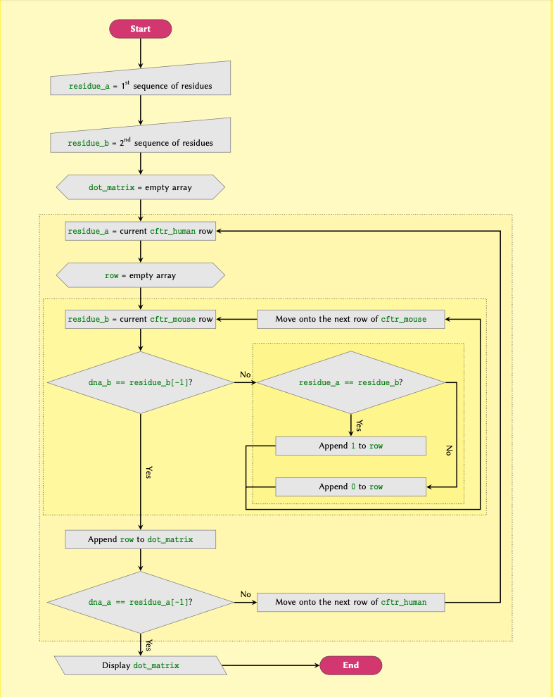
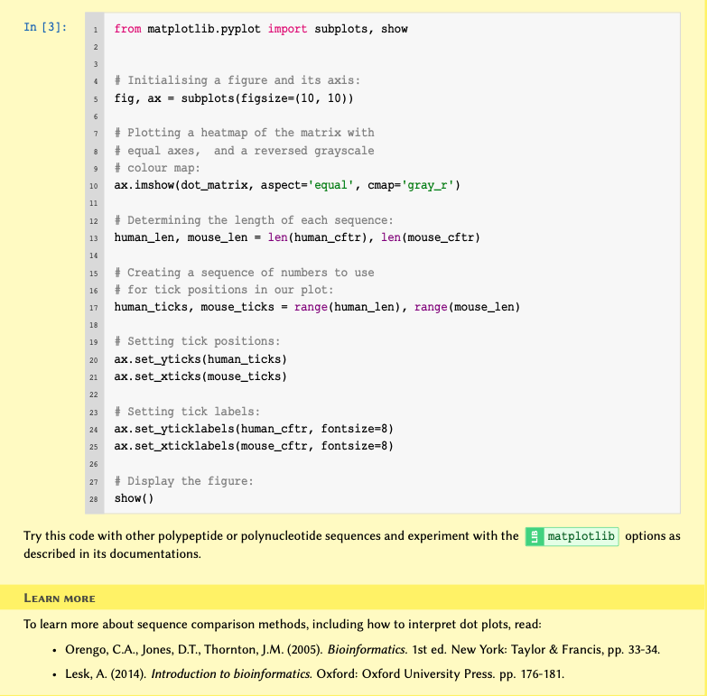
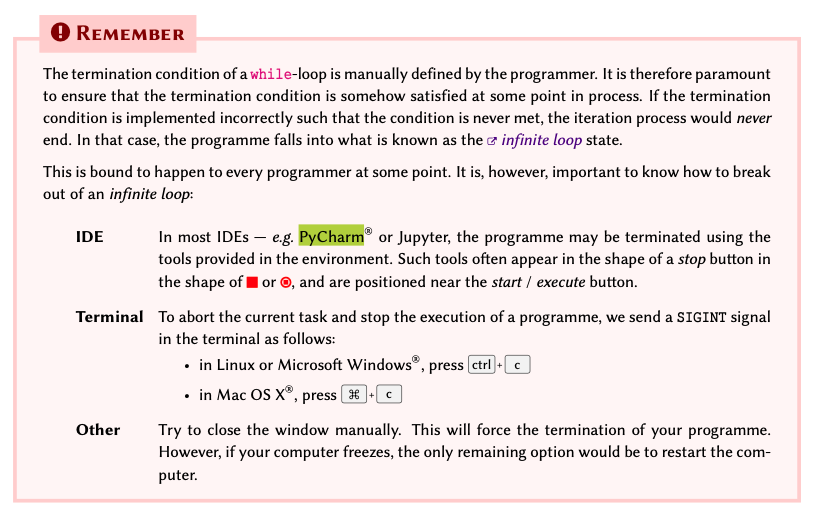

[**Download Chapter PDF (.pdf)**](https://drive.usercontent.google.com/u/1/uc?id=1jI4PH0JLnw5_7jgEwKySYgZvQEEn0DH6&export=download)

[**Download Chapter notebook (.ipynb)**](https://drive.usercontent.google.com/u/1/uc?id=1PyEb2xxLWwd1qXbwHAS-XfZl8Na4D8_X&export=download)

[<span style="color: rgb(255, 0, 0);">**Lesson Feedback Survey**</span>](https://docs.google.com/forms/d/e/1FAIpQLSdr0capF7jloJhPH3Pki1B3LZoKOG16poOpuVJ7SL2LkwLHQA/viewform?pli=1)

```{r setup, include=FALSE}
library(reticulate)

# Unset any previously set Python environments to avoid conflicts
Sys.unsetenv("RETICULATE_PYTHON")

# Check if Pandoc is available
if (!file.exists("/opt/homebrew/bin/pandoc")) {
  stop("Pandoc is not found. Please install Pandoc or update the path.")
}

# Dynamically set the Python environment
tryCatch({
  use_virtualenv("/Users/Adam/.virtualenvs/r-reticulate", required = TRUE)
  cat("Python environment set successfully.\n")
}, error = function(e) {
  cat("Error setting Python environment:", e$message, "\n")
  stop("Failed to set Python environment.")
})

# Validate Python environment
tryCatch({
  py_config()
  py_run_string("import numpy")  # Check for numpy availability
  cat("Python environment and numpy are correctly configured.\n")
}, error = function(e) {
  cat("Error in Python environment configuration or numpy check:", e$message, "\n")
  stop("Failed to validate Python environment.")
})

# Configure knitr chunks to ensure Python code is executed correctly
knitr::opts_chunk$set(
  eval = TRUE,    # Execute the code chunks
  echo = TRUE,    # Display the code chunks in the final output
  message = FALSE,  # Suppress messages from being shown
  warning = FALSE,  # Suppress warnings from being shown
  results = 'markup',  # Ensure output is handled properly
  engine = "python"  # Use Python engine for relevant chunks
)

cat("Setup chunk complete.\n")
```

:::::::::::::::::::::::::::::::::::::: questions

- What do we mean by *iterations* and *loops*?
- How are ```for```-loops implemented?
- Can conditional statements be used in iterations?
- What are ```while```-loops, and how are these used?

::::::::::::::::::::::::::::::::::::::::::::::::


::::::::::::::::::::::::::::::::::::: objectives

- Understanding the concepts behind iterations and loops.
- Learning the processes involved in ```for```-loops implementation.
- Building conditional statements into loops.
- Understanding the concept of ```while```-loops, and when to use them.

::::::::::::::::::::::::::::::::::::::::::::::::

<br>
<p align = "center">
<iframe width="560" height="315" src="https://www.youtube.com/embed/40mryCzIBwc" title="YouTube video player" frameborder="0" allow="accelerometer; autoplay; clipboard-write; encrypted-media; gyroscope; picture-in-picture" allowfullscreen></iframe>
</p>
<br>
<p align = "center">
<iframe width="560" height="315" src="https://www.youtube.com/embed/-Ex4JtqhWLw" title="YouTube video player" frameborder="0" allow="accelerometer; autoplay; clipboard-write; encrypted-media; gyroscope; picture-in-picture" allowfullscreen></iframe>
</p>
<br>
This chapter assumes that you are familiar with the following concepts in Python.

:::::::::::::::::: prereq
- [I/O Operations](02-input_output.Rmd#operations)
- [Variables and Types](02-input_output.Rmd#varTypes)
- [Mathematical Operations](02-input_output.Rmd#math_ops)
- [Logical Operations](02-input_output.Rmd#subsec:logicalOperatons)
- [Indentation Rule](03-conditional_statements.Rmd#subsubsec:indentationRule)
- [Conditional Statements](03-conditional_statements.Rmd)
- [Arrays](04-arrays.Rmd)

::::::::::::::::::

<p style='text-align: justify;'>
Additionally, make sure that you are comfortable with the principles of [indexing](04-arrays.Rmd#sec:list:indexing) in arrays before commencing this lesson. It is very important that you have a good understanding of arrays and sequences, because the concept of iteration in programming deals *almost* exclusively with these subjects.
</p>

:::::::::::::::::::::::::::::::::::: callout
## Note
<p style='text-align: justify;'>
You can practice everything in this lesson as you have been doing so far. However, if you find it hard to grasp some of the concepts, do not worry. It takes practice. To help you with that, [Philip Guo](http://www.pgbovine.net) from UC San Diego (Calif., USA) has developed [PythonTutor.com](http://www.pythontutor.com/visualize.html\#mode=edit) - an excellent online tool for learning Python. On that website, write, or paste your code into the editor, and click *Visualize Execution*. In the new page, use the *forward* and *back* buttons to see a step-by-step graphical visualisation of the processes that occur during the execution of your code. Try it on the examples in this section.
</p>

::::::::::::::::::::::::::::::::::::


## The concept
<p style='text-align: justify;'>
We make use of iterations and loops in programming to perform repetitive operations. A repetitive operation is where one or several defined operations that are repeated multiple times.
</p>

For instance, suppose we have a ```list``` of 5 numbers as follows:

```
numbers = [-3, -2, 5, 0, 12]
```

Now we would like to multiply each number by 2. Based on what we have learned thus far, this is how we would approach this problem:

```{python}
numbers = [-3, -2, 5, 0, 12]

numbers[0] *= 2
numbers[1] *= 2
numbers[2] *= 2
numbers[3] *= 2
numbers[4] *= 2

print(numbers)
```

<p style='text-align: justify;'>
Whilst this does the job, it is clearly very tedious. Furthermore, if we have a list of several thousand members, this approach quickly becomes infeasible.
</p>

The process of multiplying individual members of our array by 2 is a very simple example of a repetitive operation.


:::::::::::::::::::::::::::::::::::: callout
## Remember
In programming, there is a universally appreciated golden principle known as the **DRY** rule; and this is what it stands for:

<p align = "center">
**D**on't **R**epeat **Y**ourself
</p>

So if you find yourself doing something again and again, it is fair to assume that there might be a better way of getting the results you're looking for.

Some programrs (with questionable motives) have created **WET** rule too. Find out more about DRY and WET from [Wikipedia](https://en.wikipedia.org/wiki/Don\%27t_repeat_yourself).

::::::::::::::::::::::::::::::::::::

<p style='text-align: justify;'>
There are some universal tools for iterations that exist in all programming languages --- *e.g.* <kbd>for</kbd> and <kbd>while</kbd>-loops. There are also other tools such as vectorisation or generators, that are often unique to one or several specific programming languages.
</p>

<p style='text-align: justify;'>
In this section of the lesson, we will discuss iterations via <kbd>for</kbd> and <kbd>while</kbd>-loops, and review some real-world examples that may only be addressed using iterative processes.
</p>

## for-loops {#for-loop}

<p style='text-align: justify;'>
There is evidence that up to 80\% of all conventional iterations are implemented as <kbd>for</kbd>-loops. Whether or not it is the best choice in all these cases is subject to opinion. What is important, however, is to learn the difference between the two methods, and feel comfortable with how they work.
</p>

<p style='text-align: justify;'>
Implementation of <kbd>for</kbd>-loops in Python is simple compared to other programming languages. It essentially iterates through an existing *iterable* variable --- (such as an array) and retrieves the values from it one by one, from the beginning through to the end.
</p>

:::::::::::::::::::::::::::::::::::: callout
## Remember
<p style='text-align: justify;'>
In Python, *iterable* is a term used to refer to a variable that can be iterated through. Any variable type that can be used in a <kbd>for</kbd>-loop *without* any modifications, is therefore considered an *iterable*.
</p>

<p style='text-align: justify;'>
Most arrays and sequences are iterable. See [Table](02-input_output.Rmd#fig:nativeTypes) to find out which native types in Python are iterable. A rule of thumb is that if an array or a sequence is numerically indexed (e.g.  ```list```, ```tuple```, or ```str```), then it is considered an iterable.
</p>

::::::::::::::::::::::::::::::::::::

{#flowchart}


[Figure](#flowchart) illustrates a flowchart to visualise the workflow of an iterative process using <kbd>for</kbd>-loops in Python. The process depicted in the flowchart may be described as follows:


:::::::::::::::::::::::::::::::::::: discussion
## Process
1. A ```for```-loop is initialised using an array or a sequence, and begins its process by sequentially going through the values, starting at the array’s first row.

2. **Iterative Process:** The value of the *current row* is retrieved and given the alias <span style="color: rgb(32, 121, 77);">item</span>, which now represents a single variable within the context of the loop.

3. **Repetitive Operation(s):** Designated operations are performed using the value of <span style="color: rgb(32, 121, 77);">item</span>:

    - <span style="color: rgb(32, 121, 77);">item *= 2</span>

4. **Loop Condition:** The <kbd>for</kbd>-loop *automatically* checks whether or not it has reached the last row of the sequence. Depending on the outcome of this check:

    - **NO (last value not reached):** Move onto the next row and *repeat* the process from step 2.
    - **YES (last value reached):** Exit the loop.

::::::::::::::::::::::::::::::::::::

We write this process in Python as follows:

```{python}
numbers = [3, 5, 6.3, 9, 15, 3.4]

for item in numbers:
    item *= 2
    # Display the item to see the results:
    print(item)

```

<p style='text-align: justify;'>
We can see that the result for each iteration is displayed on a new line. The [example](#ExtExmp) outlines other such applications and expands on repetitive operations that may be simplified using <kbd>for</kbd>-loops.
</p>


:::::::::::::::::::::::::::::::::::: callout
## Advanced Topic
<p style='text-align: justify;'>
An iterable is a Python variable that contains the built--in method ```.__iter__()```. Methods starting and ending with two underscores (dunderscores) are also known as *magic methods* in Python. See the official [Python documentation](https://docs.python.org/3/tutorial/classes.html\#iterators) for additional information.
</p>

::::::::::::::::::::::::::::::::::::


:::::::::::::::::::::::::::::::::::: callout
## Remember
A <kbd>for</kbd>-loop is always initialised as:

```
for variable_name in an_array:
  # An indented block of processes
  # we would like to perform on the
  # members of our array one by one.
```

<p style='text-align: justify;'>
where ```an_array``` is an *iterable* variable, and ```variable_name``` is the name of the variable we temporarily assign to a member of ```an_array``` that corresponds to the current loop cycle (iteration). The number of loop cycles performed by a <kbd>for</kbd>-loop is equal to the length (number of members) of the array that we are iterating through, which in this case is called ```an_array```.
</p>

<p style='text-align: justify;'>
You can think of each iteration cycle as pulling out a row from the table that is our array (as exemplified in the lesson on [arrays](04-arrays.Rmd)) and temporarily assigning its corresponding value to a variable until the next iteration cycle.
</p>

See subsection [List Members](04-arrays.Rmd#listMem) to find the length of an array.

::::::::::::::::::::::::::::::::::::

::::::::::::::::::::::::::::::: challenge

## Practice Exercise 1

Given:

```{python}
peptides = [
    'GYSAR',
    'HILNEKRILQAID',
    'DNSYLY'
		]
```

write a <kbd>for</kbd>-loop to display each item in <span style="color: rgb(32, 121, 77);">peptides</span> alongside its index and length. Display the results in the following format:

```Peptide XXXX at index X contains X amino acids.```

::::::::::::::::: solution

## ANSWER
```{python}
for sequence in peptides:
    length = len(sequence)
    index = peptides.index(sequence)

    print('Peptide', sequence, 'at index', index, 'contains', length, 'amino acids.')
```

*Note: this answer covers how to use the `.index()` method, and is focused on demonstrating this, in line with what we have discussed up to this point. It is, however, more effecient to use `enumerate`, which will be discussed, later in the lesson.*

:::::::::::::::::

:::::::::::::::::::::::::::::::

:::::::::::::::::::::::::::::::::::: discussion

### Extended example of iterations using ```for```-loops {#ExtExmp}
When using a <kbd>for</kbd>-loop, we can also reference other variables that have already been defined outside of the loop block:

```{python}
numbers = [3, 5, 6.3, 9, 15, 3.4]
counter = 0

for item in numbers:
    item *= 2

    # Display the item to see the results:
    print('Iteration number', counter, ':', item)

    counter += 1
```

It is also possible to define new variables inside the loop, but remember that the value of any variables defined inside a loop is reset with each iteration cycle:

```{python}
numbers = [3, 5, 6.3, 9, 15, 3.4]
counter = 0

for item in numbers:
    new_value = item * 2

    # Display the item to see the results:
    print('Iteration number', counter, ':', item, '* 2 =', new_value)

    counter += 1
```

::::::::::::::::::::::::::::::::::::
::::::::::::::::::::::::::::::: challenge

## Practice Exercise 2

Write a ```for```-loop to display the values of a ```tuple``` defined as:
```{python}
protein_kinases = ('PKA', 'PKC', 'MPAK', 'GSK3', 'CK1')
```

such that each protein is displayed on a new line and follows the phrase ```Protein Kinase X:``` as in

```
Protein Kinase 1: PKA
Protein Kinase 2: PKC
```

and so on.

::::::::::::::::: solution
## ANSWER

```{python}
counter = 1

for protein in protein_kinases:
    print('Protein Kinase ', counter, ': ', protein, sep='')
    counter += 1
```

:::::::::::::::::

:::::::::::::::::::::::::::::::

### **Retaining the new values**
<p style='text-align: justify;'>
It is nice to be able to manipulate and display the values of an array but in the majority of cases, we need to retain the new values and use them later.
</p>

In such cases, we have two options:

  - Create a new array to store our values.
  - Replace the existing values with the new ones by overwriting them in the same array.

<p style='text-align: justify;'>
Creating a new array to store our values is very easy. We must firstly create a new ```list``` and add values to it with each iteration. In other words, we start off by creating an empty ```list```; to which we then iteratively add members using the <kbd>.append()</kbd> method inside our <kbd>for</kbd>-loop. The process of creating a new ```list``` and using the <kbd>.append()</kbd> method to values to an existing ```list``` are discussed in [Useful Methods](04-arrays.Rmd#subsubsec:list:usefulMethodsForList) and [mutability](04-arrays.Rmd#subsubsec:list:mutability), respectively.
</p>

```{python}
numbers = [-4, 0, 0.3, 5]
new_numbers = list()

for value in numbers:
    squared = value ** 2
    new_numbers.append(squared)

print('numbers:', numbers)
print('new_numbers:', new_numbers)
```


::::::::::::::::::::::::::::::: challenge

## Practice Exercise 3

Given:

```{python}
peptides = [
    'GYSAR',
    'HILNEKRILQAID',
    'DNSYLY'
		]
```
write a ```for```-loop in which you determine the length of each sequence in <span style="color: rgb(32, 121, 77);">peptides</span>, and then store the results as a ```list``` of ```tuple``` items as follows:

```
[('SEQUENCE_1', X), ('SEQUENCE_2', X), ...]
```

::::::::::::::::: solution

## ANSWER

```{python}
peptides_with_length = list()

for sequence in peptides:
    length = len(sequence)
    item = (sequence, length)

    peptides_with_length.append(item)
    
print(peptides_with_length)
```

:::::::::::::::::

:::::::::::::::::::::::::::::::

The replacement method uses a slightly different approach. Essentially, what we are trying to achieve is:


  - Read the value of an item in an array;
  - Manipulate the value via operations;
  - Return the value back into the original array through *item assignment*, thereby replacing the existing value.

<p style='text-align: justify;'>
We learned about modifying an existing value in a ```list``` in our discussion of [mutability](04-arrays.Rmd#subsubsec:list:mutability), where we discussed the concept of *item assignment*. The process of replacing the original values of an array in a <kbd>for</kbd>-loop is identical. An important point to be aware of, however, is that we make use of the correct *index* for the specific item in the array that we are trying to modify. Additionally, don't forget that *item assignment* is only possible in mutable arrays such as ```list```. See [Table](02-input_output.Rmd#fig:nativeTypes) to see which types of data container are mutable in Python.
</p>

<p style='text-align: justify;'>
To perform *item assignment*, we can use a variable to represent the current iteration cycle in our <kbd>for</kbd>-loop. We do so by initialising the variable with a value of 0, and adding 1 to its value at the end of each cycle. We can then use that variable as an *index* in each iteration cycle:
</p>

```{python}
numbers = [-4, 0, 0.5, 5]

# Variable representing the
# index (iteration cycle):
index = 0

for value in numbers:
    new_value = value ** 5

    # Putting it back into
    # the original array:
    numbers[index] = new_value

    # Adding one to the index for
    # the next iteration cycle:
    index += 1

print(numbers)
```

:::::::::::::::::::::::::::::::::::: callout
## Advanced Topic
<p style='text-align: justify;'>
The ```enumerate()``` function actually returns a *generator* of ```tuple``` items each time it is called in the context of a ```for```-loop. A generator is, in principle, similar to a normal array; however, unlike an array, the values of a generator are not evaluated by the computer until the exact time at which they are going to be used. This is an important technique in functional programming known as *lazy evaluation*. It is primarily utilised to reduce the workload on the computer (both the processor and the memory) by preventing the execution of processes that could otherwise be delayed to a later time. In the case of the ```enumerate()``` function, the values are evaluated at the beginning of each iteration cycle in a ```for```-loop. Learn more about lazy evaluation in [Wikipedia](https://en.wikipedia.org/wiki/Lazy_evaluation) or read more on generators in Python in the [official documentation](https://docs.python.org/3/howto/functional.html\#generators).
</p>

::::::::::::::::::::::::::::::::::::

<p style='text-align: justify;'>
This is a perfectly valid approach and is used in many programming languages. However, Python makes this process even easier by introducing the function <kbd>enumerate()</kbd>. We often use this function at the initiation of a <kbd>for</kbd>-loop. The function takes an array as an input and as the name suggests, enumerates them; thereby simplifying the indexing process. The previous example may, therefore, be written more concisely in Python, as follows:
</p>

```{python}
numbers = [-4, 0, 0.5, 5]

for index, value in enumerate(numbers):
    # Manipulating the value:
    new_value = value ** 5
    numbers[index] = new_value

print(numbers)
```

::::::::::::::::::::::::::::::: challenge

## Practice Exercise 4 {#diy:loops:for:enumerate}

Given:
```{python}
characters = ['1', '2', '3']
```
Display each item in one line as many times as the value of its (zero-based) index. The results should appear as follows:

```
1
22
333
```
::::::::::::::::: solution

## ANSWER
```{python}
for index, item in enumerate(characters):
    print(item * (index + 1))
```

:::::::::::::::::

:::::::::::::::::::::::::::::::

### **for-loop and conditional statements** {#subsubsec:loops:for:conditionalStatements}
We can use conditional statements within <kbd>for</kbd>-loops to account for and handle different situations.

Suppose we want to find the smallest value (the minimum) within a ```list``` of numbers using a <kbd>for</kbd>-loop. The workflow of this process is displayed as a flowchart diagram in [figure below](#flowchart5-2-2).

{#flowchart5-2-2}

Given an array, we can break down the problem as follows:


Finally, we can implement the process displayed in [figure](#flowchart5-2-2) as follows:

```{python}
numbers = [7, 16, 0.3, 0, 15, -4, 5, 3, 15]

minimum = numbers[0]

for value in numbers:
    if value < minimum:
        minimum = value

print('The minimum value is:', minimum)
```

::::::::::::::::::::::::::::::: challenge

## Practice Exercise 5
Given:
```{python}
peptides = [
  'FAEKE',
  'CDYSK',
  'ATAMGNAPAKKDT',
  'YSFQW',
  'KRFGNLR',
  'EKKVEAPF',
  'GMGSFGRVML',
  'YSFQMGSFGRW',
  'YSFQMGSFGRW'
		]
```
Using a ```for```-loop and a conditional statement, find and display the sequences in <span style="color: rgb(32, 121, 77);">peptides</span> that contain the amino acid serine (<span style="color: rgb(32, 121, 77);">S</span>) in the following format:

```
Found S in XXXXX.
```
::::::::::::::::: solution

## ANSWER

```{python}
target = 'S'

for sequence in peptides:
    if target in sequence:
        print('Found', target, 'in', sequence)
```
:::::::::::::::::

:::::::::::::::::::::::::::::::

### **Sequence of numbers in for-loops** {#subsec:iter:for:range}
<p style='text-align: justify;'>
In order to produce a sequence of ```int``` numbers for use in a <kbd>for</kbd>-loop, we can use the built-in <kbd>range()</kbd> function. The function takes in three positional arguments representing *start*, *stop*, and *step*. Note that <kbd>range()</kbd> is *only* capable of producing a sequence of integer numbers.
</p>

:::::::::::::::::::::::::::::::::::: callout
## Remember
The <kbd>range()</kbd> function does not create the sequence of numbers immediately. Rather, it behaves in a similar way to the <kbd>enumerate()</kbd> function does (as a generator).

::::::::::::::::::::::::::::::::::::

Displaying the output of the <kbd>range()</kbd> function is not an array of numbers, as you might expect:

```{python}
range_generator = range(0, 10, 2)

print(range_generator)
```


It is, however, possible to evaluate the values outside of a <kbd>for</kbd>-loop. To do so, we need to convert the output of the function to ```list``` or a ```tuple```:

```{python}
range_sequence = list(range_generator)

print(range_sequence)
```

:::::::::::::::::::::::::::::::::::: callout
## Remember
<p style='text-align: justify;'>
The <kbd>range()</kbd> function is *non-inclusive*. That is, it creates a sequence that starts from and includes the value given as the *start* argument, up to but *excluding* the value of the *end* argument. For instance, ```range```(1, 5, 1) creates a sequence starting from <span style="color: rgb(32, 121, 77);">1</span>, which is then incremented <span style="color: rgb(32, 121, 77);">1</span> step at a time right up to <span style="color: rgb(32, 121, 77);">5</span>, resulting in a sequence that includes the following numbers: <span style="color: rgb(32, 121, 77);">1, 2, 3, 4</span>
</p>

::::::::::::::::::::::::::::::::::::

:::::::::::::::::::::::::::::::::::: discussion

## Example: Sequence comparison, dot plots and ```for``` loops{#bigexam}
{#example}
{#dot}
{#dotImp}




::::::::::::::::::::::::::::::::::::

## while-loops

<p style='text-align: justify;'>
In our discussion of ```for``` loop mediated iterations above, we learned that they are *exclusively* applied to iterable objects --- such as arrays and sequences. This is because, as demonstrated in [workflow figure](#flowchart), at the end of each iteration, the *implicit* termination condition that is inherent in the process tests whether or not the end of the sequence being iterating through, has been reached.
</p>

<p style='text-align: justify;'>
It may, however, be deemed necessary to apply iterative processes based on conditions other than those embedded within the ```for```-loop. In such cases, we use a different class of iterations known as a ```while```-loop.
</p>




Consider the following:

>We want to ask a user to enter a sequence of exactly five amino acids in single-letter code. If the provided sequence is more or less than five letters long, we would like to display a message and ask them to try again; otherwise, we will display the process and terminate the program.


<p style='text-align: justify;'>
It is impossible to write such a process using a ```for```-loop. This is because when we initialise the iteration process in a ```for```-loop, the number of loops we need is known, in advance. In other words, we simply do not know how many times the user would need to enter said sequence before they get it right.
</p>

{#flowchart3}

<p style='text-align: justify;'>
To simplify the understanding of the concept, we can visualise the process in a flowchart, as displayed in [figure](#flowchart3). In this flowchart, you can see that the only way to exit the loop is to enter a sequence of exactly five characters. Doing anything else --- such as entering a different number of letters -- is equivalent to going back to the beginning of the loop. The process may be described verbally as follows:
</p>

1.  Initialise the variable <span style="color: rgb(32, 121, 77);">sequence</span> and assign an empty string to it.

2. *While* the length of <span style="color: rgb(32, 121, 77);">sequence</span> is not equal to 5:

   - Ask the user to enter a new <span style="color: rgb(32, 121, 77);">sequence</span>.
   - Go back to step <span style="color: rgb(32, 121, 77);">\#2</span>.

3. Display the value of <span style="color: rgb(32, 121, 77);">sequence</span>.


### **Implementation**
We instantiate ```while```-loop using the <kbd>while</kbd> syntax, immediately followed by the loop condition.

We can now implement the process displayed in [figure](#flowchart3) as follows:

```
sequence = str()

while len(sequence) != 5:
    sequence = input('Enter a sequence of exactly 5 amino acids: ')

print(sequence)
```

When executed, the above code will prompt the user to enter a value:

```
Enter a sequence of exactly 5 amino acids: GCGLLY
Enter a sequence of exactly 5 amino acids: GCGL
Enter a sequence of exactly 5 amino acids: GC
Enter a sequence of exactly 5 amino acids: GCGLL

GCGLL
```

As expected, the user is repeatedly asked to enter a five-character sequence until they supply the correct number of letters.


::::::::::::::::::::::::::::::: challenge
## Practice Exercise 6

1. Write a script which prompts the user to enter a number, then:

   - If the second power of the number is smaller than <span style="color: rgb(32, 121, 77);">10</span>, repeat the process and ask again;
   - If the second power of the number is equal or greater than <span style="color: rgb(32, 121, 77);">10</span>, display the original value and terminate the program.

**Hint:** Don't forget to [convert](#sec:conversionType) the value entered by the user to an appropriate numeric type *before* you perform any mathematical operations.
<p style='text-align: justify;'>
2. We learned in subsection [Sequence of Numbers](#subsec:iter:for:range) that the built-in function <kbd>range()</kbd> may be utilised to produce a sequence of *integer* numbers. The function takes 3 input arguments in the following order: <span style="color: rgb(32, 121, 77);">start, stop, step</span>.
</p>

We now need a sequence of floating-point numbers with the following criteria:

```
stop = 10
start = 0
step = 0.5
```
<p style='text-align: justify;'>
The use of a floating-point number as <span style="color: rgb(32, 121, 77);">step</span> means that we cannot use <kbd>range()</kbd> to create the desired sequence. Write a script in which you use a ```while```-loop to produce a sequence of floating-point numbers with the above criteria and display the result.
</p>
The resulting sequence must be:

   - Presented as an instance of type ```list```;
   - Similar to <kbd>range()</kbd>, the sequence must be non-inclusive --- *i.e.* it must include the value of <span style="color: rgb(32, 121, 77);">start</span>, but not that of <span style="color: rgb(32, 121, 77);">stop</span>.

::::::::::::::::: solution

## Q1

```
value = 0

while value ** 2 < 10:
    response = input('Enter a number: ')
    value = float(response)

print(value)
```
:::::::::::::::::

::::::::::::::::: solution

## Q2
```{python}
stop = 10
start = 0
step = 0.5

number = start
sequence = list()

while number < stop:
    sequence.append(number)
    number += step

print(sequence)
```

:::::::::::::::::

::::::::::::::::: solution

## Q2 - Smart Solution
```{python}
# A smarter solution, however, would be:
stop = 10
start = 0
step = 0.5

sequence = [start]

while sequence[-1] < stop:
    sequence.append(sequence[-1] + step)

print(sequence)

```

:::::::::::::::::
:::::::::::::::::::::::::::::::

### **Breaking a while-loop**

Unlike ```for```-loops, it is common to *break* out of a ```while```-loop, mid-process. This is also known as *premature termination*.

To consider a situation that may necessitate such an approach, we shall modify our scenario as follows:

<p style='text-align: justify;'>
>We want to ask the user to enter a sequence of exactly five amino acids. If the sequence the user provides is more or less than five letters long, we would like to display a message and ask them to try again; otherwise, we will display the sequence and terminate the program. Additionally, the loop should be terminated:
   - upon two failed attempts; or,
   - if the user enters the word <span style="color: rgb(32, 121, 77);">exit</span> instead of a five-character sequence.

</p>
In the former case, however, we would also like to display a message and inform the user that we are terminating the program because of three failed attempts.

To implement the first addition to our code, we will have to make the following alterations in our code:

   - Define a variable to hold the iteration cycle, then test its value at the beginning of each cycle to ensure that it is below the designated threshold. Otherwise, we manually terminate the loop using the <kbd>break</kbd> syntax.

   - Create a [conjunctive](#disjun) conditional statement for the ```while```-loop to make, so that it is also sensitive to our <span style="color: rgb(32, 121, 77);">exit</span> keyword.


```
sequence = str()
counter = 1
max_counter = 3
exit_keyword = 'exit'

while len(sequence) != 5 and sequence != exit_keyword:
    if counter == max_counter:
        sequence = "Three failed attempt - I'm done."
        break

    sequence = input('Enter a sequence of exactly 5 amino acids or [exit]: ')

    counter += 1

print(sequence)
```

## Exercises
:::::::::::::::::::::::::::::::::::::::: challenge

### End of chapter Exercises

1. Can you explain the reason why, in the example given in subsection [for-loop and conditional statements](#subsubsec:loops:for:conditionalStatements) we set <span style="color: rgb(32, 121, 77);">minimum</span> to be equal to the first value of our array instead of, for instance, zero or some other number?

Store your answer in a variable and display it using <kbd>print()</kbd>.

2. Write a script that using a <kbd>for</kbd>-loop, calculates the sum of all numbers in an array defined as follows:

```
numbers = [0, -2.1, 1.5, 3]
```

and display the result as:

```
Sum of the numbers in the array is 2.4
```
3. Given an array of integer values as:

```
numbers = [2, 1, 3]
```

write a script using <kbd>for</kbd>-loops, and display each number in the list as many times as the number itself. The program must therefore display '2' twice, '1' once, and '3' three times.

4.  Given a ```list``` of numbers defined as:

```
numbers = [7, 16, 0.3, 0, 15, -4, 5, 3, 15]
```

write a script that using (at most) two <kbd>for</kbd>-loops, finds the *variance* of the numbers, and display the **mean**, and the **variance**. Note that you will need to calculate the *mean* as a part of your calculations to find the *variance*.

The equation for calculating variance is:

$$\sigma^2 = \frac{\sum^{n}_{i=1}(x_i - \mu)^2}{n}$$

**Hint:** *Breaking down the problem into smaller pieces will simplify the process of translating it into code and thereby solving it:*

(a) Work out the Mean or $\mu$ (the simple average of the numbers):
$$ \mu = \frac{\sum^{n}_{i=1} x_i}{n}$$
(b) Calculate the sum of: each number ($x_i$) subtracted by the Mean ($\mu$) and square the result.

(c) Divide the resulting number by the length of <span style="color: rgb(32, 121, 77);">number</span>.


Display the results in the following format:

```
Mean: XXXX
Variance: XXXX
```

::::::::::::::::::::: solution

## Solutions will be provided once the submitted assignments are marked and returned.

:::::::::::::::::::::
::::::::::::::::::::::::::::::::::::::::


::::::::::::::::::::::::::::::::::::: keypoints

- Iterations and loops are used to perform repetitive operations.
- Implementation of ```for```-loops involves four steps.
- Conditional statements are used within loops to handle different situations.
- ```while```-loops are most suitable when an exact number of conditions/iterations is unknown.

::::::::::::::::::::::::::::::::::::::::::::::::


[r-markdown]: https://rmarkdown.rstudio.com/
