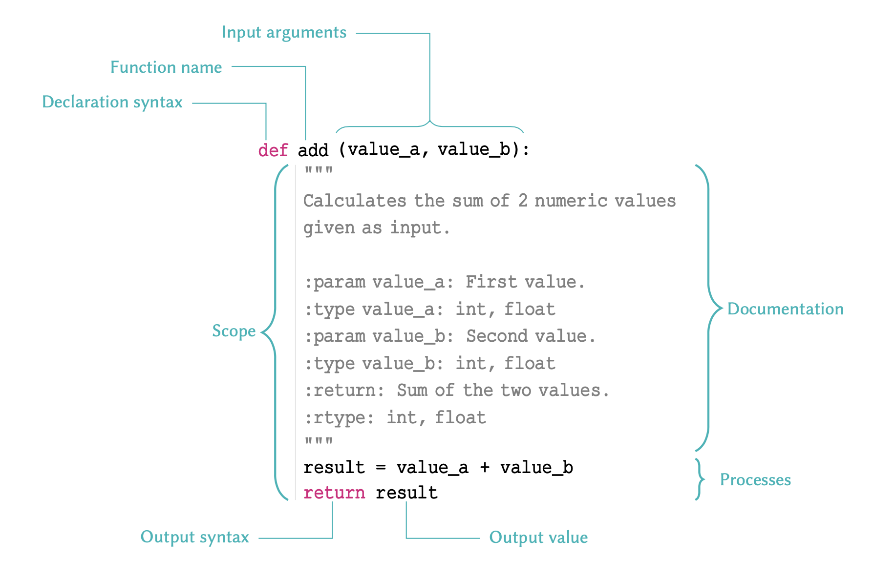
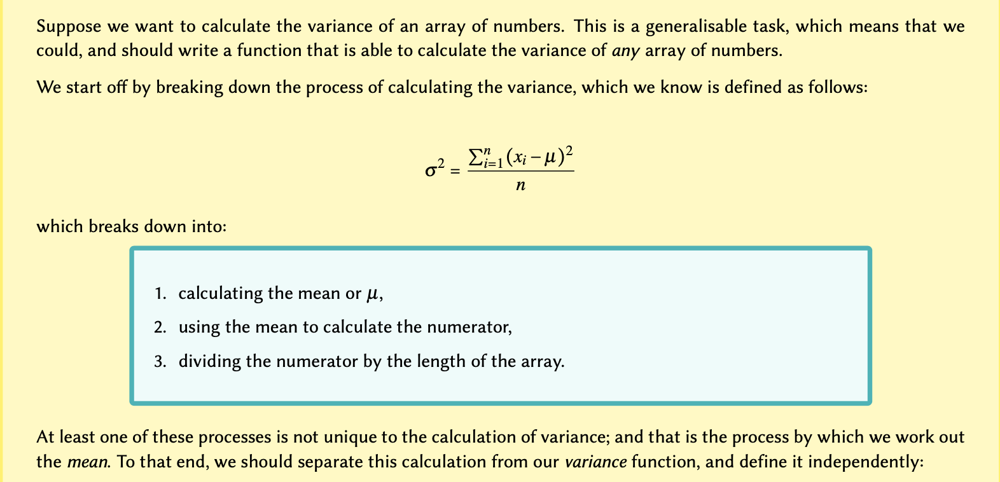

[**Download Chapter PDF (.pdf)**](https://drive.usercontent.google.com/u/1/uc?id=1JeHB5VH5L2iflg8CY2VJQq5a1OX098TG&export=download)

[**Download Chapter notebook (.ipynb)**](https://drive.usercontent.google.com/u/1/uc?id=1cc_GvQ37SoeFRRAcGGLRHvmrJg9MvSWU&export=download)

[<span style="color: rgb(255, 0, 0);">**Lesson Feedback Survey**</span>](https://docs.google.com/forms/d/e/1FAIpQLSdr0capF7jloJhPH3Pki1B3LZoKOG16poOpuVJ7SL2LkwLHQA/viewform?pli=1)

```{r setup, include=FALSE}
library(reticulate)

# Unset any previously set Python environments to avoid conflicts
Sys.unsetenv("RETICULATE_PYTHON")

# Check if Pandoc is available
if (!file.exists("/opt/homebrew/bin/pandoc")) {
  stop("Pandoc is not found. Please install Pandoc or update the path.")
}

# Dynamically set the Python environment
tryCatch({
  use_virtualenv("/Users/Adam/.virtualenvs/r-reticulate", required = TRUE)
  cat("Python environment set successfully.\n")
}, error = function(e) {
  cat("Error setting Python environment:", e$message, "\n")
  stop("Failed to set Python environment.")
})

# Validate Python environment
tryCatch({
  py_config()
  py_run_string("import numpy")  # Check for numpy availability
  cat("Python environment and numpy are correctly configured.\n")
}, error = function(e) {
  cat("Error in Python environment configuration or numpy check:", e$message, "\n")
  stop("Failed to validate Python environment.")
})

# Configure knitr chunks to ensure Python code is executed correctly
knitr::opts_chunk$set(
  eval = TRUE,    # Execute the code chunks
  echo = TRUE,    # Display the code chunks in the final output
  message = FALSE,  # Suppress messages from being shown
  warning = FALSE,  # Suppress warnings from being shown
  results = 'asis',  # Ensure output is handled properly
  engine = "python"  # Use Python engine for relevant chunks
)

cat("Setup chunk complete.\n")
```

:::::::::::::::::::::::::::::::::::::: questions

- What are functions?
- How are functions created?
- What are optional arguments?
- What makes functions so powerful?

::::::::::::::::::::::::::::::::::::::::::::::::


::::::::::::::::::::::::::::::::::::: objectives

- Understand how to develop and utilise functions.
- Understanding different ways of creating functions.
- Explaining input arguments.
- Understanding the interconnectivity of functions.
::::::::::::::::::::::::::::::::::::::::::::::::

<br>
<p align = "center">
<iframe width="560" height="315" src="https://www.youtube.com/embed/hcvGRK8FvQ8" title="YouTube video player" frameborder="0" allow="accelerometer; autoplay; clipboard-write; encrypted-media; gyroscope; picture-in-picture" allowfullscreen></iframe>
</p>
<br>
<p align = "center">
<iframe width="560" height="315" src="https://www.youtube.com/embed/_Y6ucZYbVL4" title="YouTube video player" frameborder="0" allow="accelerometer; autoplay; clipboard-write; encrypted-media; gyroscope; picture-in-picture" allowfullscreen></iframe>
</p>
<br>
<p align = "center">
<iframe width="560" height="315" src="https://www.youtube.com/embed/on_v5Ge80iE" title="YouTube video player" frameborder="0" allow="accelerometer; autoplay; clipboard-write; encrypted-media; gyroscope; picture-in-picture" allowfullscreen></iframe>
</p>
<br>

This chapter assumes that you are familiar with the following concepts in Python:

:::::::::::::::::: prereq
- [Mathematical Operation](02-input_output.Rmd#math_ops)
- [Indentation Rule](03-conditional_statements.Rmd#subsubsec:indentationRule)
- [Conditional Statements](03-conditional_statements.Rmd)
- [Arrays](04-arrays.Rmd)
- [Loops and Iterations](05-iterations.Rmd)

::::::::::::::::::

## Functions {#sec:functions}


[**Defining Functions**](https://docs.python.org/3/tutorial/controlflow.html\#defining-functions)

<p style='text-align: justify;'>
In programming, functions are individual units or blocks of code that incorporate and perform specific tasks in a sequence defined and written by the programmer. As we learned in the first chapter (on [outputs](02-input_output.Rmd#sub:ProducingAnOutput)), a function usually takes in one or several variables or values, processes them, and produces a specific result. The variable(s) given to a function and those produced by it are referred to as *input arguments*, and *outputs* respectively.
</p>

<p style='text-align: justify;'>
There are different ways to create functions in Python. In the L2D, we will be using <kbd>def</kbd> to implement our functions. This is the simplest and most common method for declaring a function. The structure of a typical function defined using <kbd>def</kbd> is as follows:
</p>



:::::::::::::::::::::::::::::::::::: callout

## Remember

There are several points to remember relative to functions:

<p style='text-align: justify;'>
- The name of a function follows same principles as that of any other variable as discussed in [variable names](02-input_output.Rmd#subsec:variableNames). The name must be in *lower-case* characters.
</p>

<p style='text-align: justify;'>
- The input arguments of a function --- e.g. <span style="color: rgb(32, 121, 77);">value_a</span> and <span style="color: rgb(32, 121, 77);">value_b</span> in the above example; are essentially variables whose *scope* is the function. That is, they are *only* accessible *within* the function itself, and not from anywhere else in the code.
</p>

<p style='text-align: justify;'>
- Variables defined within a function, should *never* use the same name as variables defined outside of it; or they may override each other.
</p>

<p style='text-align: justify;'>
-  A function declared using <kbd>def</kbd> should *always* be terminated with a <kbd>return</kbd> syntax. Any values or variables that follow <kbd>return</kbd> are regarded as the function's output.
</p>

<p style='text-align: justify;'>
- If we do not specify a return value, or fail to terminate a function using <kbd>return</kbd> altogether, the Python interpreter will automatically terminate that function with an implicit ```return None```. Being an *implicit* process, this is generally regarded as a bad practice and should be avoided.
</p>

::::::::::::::::::::::::::::::::::::

<p style='text-align: justify;'>
We implement functions to avoid repetition in our code. It is important that a function is *only* performing a very specific task, so that it can be context-independent. You should therefore avoid incorporating separable tasks inside a single function.
</p>

:::::::::::::::::::::::::::::::::::: callout
## Interesting Fact

<p style='text-align: justify;'>
Functions are designed to perform specific tasks. That is why in the majority of cases, they are named using *verbs* --- e.g. <kbd>add()</kbd> or <kbd>print()</kbd>. Verbs describe an action, a state, or an occurrence in the English language. Likewise, this type of nomenclature describes the action performed by a specific function. As we encourage with variable naming: sensible, short and descriptive names are best to consider, when naming a function.
</p>

::::::::::::::::::::::::::::::::::::

<p style='text-align: justify;'>
Once you start creating functions for different purposes, you will eventually amass a library of ready-to-use functions which can individually address different needs. This is the primary principle of a popular programming paradigm known as [functional programming](https://en.wikipedia.org/wiki/Functional_programming).
</p>

So let us implement the example outline in the diagram:

```{python, results='hold'}

def add(value_a, value_b):
    """
    Calculates the sum of two numeric values
    given as inputs.

    :param value_a: First value.
    :type value_a: int, float
    :param value_b: Second value.
    :type value_b: int, float
    :return: Sum of the two values.
    :rtype: int, float
    """
    result = value_a + value_b
    return result
```

<p style='text-align: justify;'>
Once implemented, we can call and use the function we created. We can do so in the same way as we do with the *built-in* functions such as <kbd>max()</kbd> or <kbd>print()</kbd>:
</p>

```{python}
res = add(2, 5)

print(res)
```

:::::::::::::::::::::::::::::::::::: callout
## Remember

When calling a function, we should always pass our *positional input arguments* in the order they are defined in the function definition: i.e. from left to right.

<p style='text-align: justify;'>
This is because in the case of *positional arguments*, as the name suggests, the Python interpreter relies on the *position* of each value to identify its *variable name* in the function signature. The function signature for our ```add``` function is as follows:
</p>

```
add(value_a, value_b)
```
<p style='text-align: justify;'>
So in the above example where we say <span style="color: rgb(32, 121, 77);">add(2, 5)</span>, the value <span style="color: rgb(32, 121, 77);">2</span> is identified as the *input argument* for <span style="color: rgb(32, 121, 77);">value_a</span>, and not <span style="color: rgb(32, 121, 77);">value_b</span>. This happens automatically because in our function call, the value <span style="color: rgb(32, 121, 77);">2</span> is written in the first position: the position at which <span style="color: rgb(32, 121, 77);">value_a</span> is defined in our function declaration (signature).
</p>

::::::::::::::::::::::::::::::::::::

<p style='text-align: justify;'>
Alternatively, we can use the name of each *input argument* to pass values onto them in any order. When we use the name of the *input argument* explicitly, we pass the values as *keyword arguments*. This is particularly useful in more complex functions where there are several *input arguments*.
</p>

Let us now use *keyword arguments* to pass values to our <kbd>add()</kbd> function:

```{python}
res = add(value_a=2, value_b=5)

print(res)
```

Now, even if we change the order of our arguments, the function would still be able to associate the values to the correct keyword argument:

```{python}
res = add(value_b=2, value_a=5)

print(res)
```

:::::::::::::::::::::::::::::::::::: callout

## Remember
<p style='text-align: justify;'>
Choose the order of your *input argument* wisely. This is important when your function can accept multiple *input arguments*.
</p>

<p style='text-align: justify;'>
Suppose we want to define a 'division' function. It makes sense to assume that the first number passed to the function will be divided by the second number:
</p>

```{python}
def divide(a, b):
    return a / b
```

It is also much less likely for someone to use *keywords* to pass arguments to this function -- that is, to say:

```{python}
result = divide(a=2, b=4)
```

than it is for them to use positional arguments (without any keywords), that is:

```{python}
result = divide(2, 4)
```

But if we use an arbitrary order, then we risk running into problems:

```{python}
def divide_bad(denominator, numerator):
    return numerator / denominator
```

<p style='text-align: justify;'>
In which case, our function would perform perfectly well if we use *keyword arguments*; however, if we rely on positional arguments and common sense, then the result of the division would be calculated incorrectly.
</p>

```{python}
result_a = divide_bad(numerator=2, denominator=4)
result_b = divide_bad(2, 4)

print(result_a == result_b)
```
::::::::::::::::::::::::::::::::::::

::::::::::::::::::::::::::::::: challenge

## Practice Exercise 1 {#diy:func:tataBoxFinder}

Implement a function called <span style="color: rgb(32, 121, 77);">find_tata</span> that takes in one ```str``` argument called <span style="color: rgb(32, 121, 77);">seq</span> and looks for the <span style="color: rgb(32, 121, 77);">TATA</span>-box motif inside that sequence. Then:

- if found, the function should return the index for the <span style="color: rgb(32, 121, 77);">TATA</span>-box as output.

- if not found, the function should *explicitly* return ```None```.

**Example:**

The function should behave, as follows:

```
sequence = 'GCAGTGTATAGTC'

res = find_tata(sequence)

```

::::::::::::::::: solution

## ANSWER
```{python}
def find_tata(seq):
    tata_box = 'TATA'
    result = seq.find(tata_box)

    return result
```
:::::::::::::::::

:::::::::::::::::::::::::::::::

### **Documentation**
<p style='text-align: justify;'>
It is *essential* to write short, informative documentation for a functions that you are defining. There is no single *correct* way to document a code. However, as a general rule, a sufficiently informative documentation should tell us:
</p>

- what a function does;

- the names of the input arguments, and what type each argument should be;

- the output, and its type.

<p style='text-align: justify;'>
This documentation string is referred to as the *docstring*. It is always written inside triple quotation marks. The *docstring* must be implemented on the *very first line*, immediately following the declaration of the function, in order for it to be recognised as documentation:
</p>

```{python,results='hold'}
def add(value_a, value_b):
    """
    Calculates the sum of two numeric values
    given as inputs.

    :param value_a: First value.
    :type value_a: int, float
    :param value_b: Second value.
    :type value_b: int, float
    :return: Sum of the two values.
    :rtype: int, float
    """
    result = value_a + value_b
    return result
```

:::::::::::::::::::::::::::::::::::: callout
## Remember
<p style='text-align: justify;'>
You might feel as though you would remember what your own functions do. Assuming this is often naive, however, as it is easy to forget the specifics of a function that you have written; particularly if it is complex and accepts multiple arguments. Functions that we implement tend to perform specialist, and often complex, interconnected processes. Whilst you might remember what a specific function does for a few days after writing it, you will likely have trouble remembering the details in a matter of months. And that is not even considering details regarding the type of the input argument(s) and those of the output. In addition, programmers often share their work with other fellow programmers; be it within their team or in the wider context of a publication, or even for distribution _via_ public repositories, as a community contribution. Whatever the reason, there is one golden rule: a function should not exist unless it is documented.
</p>

::::::::::::::::::::::::::::::::::::

<p style='text-align: justify;'>
Writing the *docstring* on the first line is important. Once a function is documented, we can use <kbd>help()</kbd>, which is a built-in function in Python, to access the documentations as follows:
</p>

```{python}
help(add)
```

<p style='text-align: justify;'>
For very simple functions -- like the <kbd>add()</kbd> function that we implemented above, it is sufficient to simplify the docstring into something straightforward, and concise. This is because it is fairly obvious what are the input and output arguments are, and what their respective types are/should be. For example:
</p>

```{python}
def add(value_a, value_b):
    """value_a + value_b -> number"""
    result = value_a + value_b
    return result
```

```{python}
help(add)
```

::::::::::::::::::::::::::::::: challenge

## Practice Exercise 2 {#diy:func:tataBoxFinderWithDocs}

Re-implement the function you defined in the previous [Practice Exercise 1](#diy:func:tataBoxFinder) with appropriate documentation.


::::::::::::::::: solution

## ANSWER

```{python, results='hold'}
def find_tata(seq):
    """
    Finds the location of the TATA-box,
    if one exists, in a polynucleotide
    sequence.

    :param seq: Polynucleotide sequence.
    :type seq: str
    :return: Start of the TATA-box.
    :rtype: int
    """
    tata_box = 'TATA'
    result = seq.find(tata_box)

    return result
```

:::::::::::::::::

:::::::::::::::::::::::::::::::

### Optional arguments

<p style='text-align: justify;'>
We already know that most functions accept one or more input arguments. Sometimes a function does not need all of the arguments in order to perform a specific task.
</p>

<p style='text-align: justify;'>
Such an example that we have already worked with is <kbd>print()</kbd>. We already know that this function may be utilised to display text on the screen. However, we also know that if we use the ```file``` argument, it will behave differently in that it will write the text inside a file instead of displaying it on the screen. Additionally, <kbd>print()</kbd> has other arguments such as ```sep``` or ```end```, which have specific default values of <span style="color: rgb(32, 121, 77);">' '</span> (a single space) and <span style="color: rgb(32, 121, 77);">\\n</span> (a linebreak) respectively.
</p>

:::::::::::::::::::::::::::::::::::: callout
## Remember
<p style='text-align: justify;'>
Input arguments that are necessary to call a specific function are referred to as *non-default arguments*. Those whose definition is not mandatory for a function to be called are known as *default* or *optional arguments*.
</p>

<p style='text-align: justify;'>
Optional arguments may *only* be defined *after* non-default arguments (if any). If this order is not respected, a ```SyntaxError``` will be raised.
</p>

::::::::::::::::::::::::::::::::::::

:::::::::::::::::::::::::::::::::::: callout
## Advanced Topic
<p style='text-align: justify;'>
The default value defined for *optional arguments* can theoretically be an instance of any type in Python. However, it is better and safer to only use *immutable* types (as demonstrated in [Table](02-input_output.Rmd#tb:types:nativeTypes)) for default values. The rationale behind this principle is beyond the scope of this course, but you can read more about it in the [official documentation](https://docs.python.org/3/tutorial/controlflow.html\#default-argument-values).
</p>

::::::::::::::::::::::::::::::::::::

<p style='text-align: justify;'>
In order to define functions with optional arguments, we need to assign a default value to them. Remember: input arguments are variables with a specific scope. As a result, we can treat our input argument as variables and assign them a value:
</p>

```{python, results='hold'}
def prepare_seq(seq, name, upper=False):
    """
    Prepares a sequence to be displayed.

    :param seq: Sequence
    :type seq: str
    :param name: Name of the sequence.
    :type name: str
    :param upper: Convert sequence to uppercase characters (default: False)
    :type upper: bool
    :return: Formatted string containing the sequence.
    :rtype: str
    """
    template = 'The sequence of {} is: {}'

    if not upper:
        response = template.format(name, seq)
    else:
        seq_upper = seq.upper()
        response = template.format(name, seq_upper)

    return response
```

Now if we don't explicitly define ```upper``` when calling <kbd>prepare_seq()</kbd>, its value is automatically considered to be ```False```:

```{python}
sequence = 'TagCtGC'

prepped = prepare_seq(sequence, 'DNA')

print(prepped)
```

If we change the default value of ```False``` for ```upper``` and set to ```True```, our sequence should be converted to upper case characters:

```{python}
prepped = prepare_seq(sequence, 'DNA', upper=True)

print(prepped)
```


::::::::::::::::::::::::::::::: challenge

## Practice Exercise 3

Modify the function from the previous [Practice Exercise 2](#diy:func:tataBoxFinderWithDocs) to accept an *optional argument* called ```upper```, with a default value of ```False```. Thereafter:


- if ```upper``` is ```False```, then the function should perform as it already does (similar to the previous [Practice Exercise 2](#diy:func:tataBoxFinderWithDocs));

- if ```upper``` is ```True```, then the function should convert the sequence to contain only uppercase characters, before it looks for the <span style="color: rgb(32, 121, 77);">TATA</span>-box.

Do not forget to update the *docstring* of your function.


::::::::::::::::: solution

## ANSWER

```{python, results='hold'}
def find_tata(seq, upper=False):
    """
    Finds the location of the TATA-box,
    if one exists, in a polynucleotide
    sequence.

    :param seq: Polynucleotide sequence.
    :type seq: str
    :param upper: Whether or not to
     homogenise the sequence
     to upper-case characters.
    :type upper: bool
    :return: Start of the TATA-box.
    :rtype: int
    """
    tata_box = 'TATA'

    if not upper:
        result = seq.find(tata_box)
    else:
        seq_prepped = seq.upper()
        result = seq_prepped.find(tata_box)

    return result
```
:::::::::::::::::

:::::::::::::::::::::::::::::::

:::::::::::::::::::::::::::::::::::: callout
## Remember
<p style='text-align: justify;'>
It is not necessary to implement your functions in this way. It is, however, a common practice among programmers in any programming language. For this reason, you should be at least be familiar with the technique, as you will likely encounter it at some point.
</p>

::::::::::::::::::::::::::::::::::::

<p style='text-align: justify;'>
It is important to note that it is also possible to have more than one <kbd>return</kbd> in a function. This is useful when we need to account for different outcomes; such as the one we saw in the previous example with <kbd>prepare_seq()</kbd>.
</p>

This means that we can simplify the process as follows:

```{python, results='hold'}
def prepare_seq(seq, name, upper=False):
    """
    Prepares a sequence to be displayed.

    :param seq: Sequence
    :type seq: str
    :param name: Name of the sequence.
    :type name: str
    :param upper: Convert sequence to uppercase characters (default: False)
    :type upper: bool
    :return: Formated string containing the sequence.
    :rtype: str
    """
    template = 'The sequence of {} is: {}'

    if not upper:
        return template.format(name, seq)

    seq_upper = seq.upper()
    return template.format(name, seq_upper)
```

Notice that we got rid of <span style="color: rgb(32, 121, 77);">response</span>. Here is a description of what is happening:

- In this context, if the conditional statement holds --- i.e. when ```upper``` is ```False```--- we enter the <kbd>if</kbd> block. In this case, we reach the first ```return``` statement. It is at this point, that function returns the corresponding results, and immediately terminates.

- Conversely, if the conditional statement does not hold --- i.e. where ```upper``` is ```True``` --- we skip the <kbd>if</kbd> block altogether and proceed. It is only then that we arrive at the second ```return``` statement where the alternative set of results are prepared.


This does not alter the functionality of the function, in any way. However, in complex functions which can be called repetitively (*e.g.*  inside <kbd>for</kbd> loop), this technique may improve the performance of the function.

Now if we call our function, it will behave in exactly the same way as it did before:

```{python}
sequence = 'TagCtGC'

prepped = prepare_seq(sequence, 'DNA')

print(prepped)
```


```{python}
prepped = prepare_seq(sequence, 'DNA', upper=True)

print(prepped)
```

### **Interconnectivity of functions**
Functions can also call other functions. This is what makes them extremely powerful tools that may be utilised to address an unlimited number of problems.

This allows us to devise a network of functions that can all call each other to perform different tasks at different times. This network of functions can then collectively contribute to the production of a single, final answer.

:::::::::::::::::::::::::::::::::::: callout
## Remember
Functions should have specialist functionalities.They should ideally be written to perform one task, and one task only.

So in instances where more operations are required, it is advised not to write more code to execute these, into one function. This would defy the ethos of functional programming. Instead, consider writing more functions that contain less code, and perform more specialist functionalities.

::::::::::::::::::::::::::::::::::::

:::::::::::::::::::::::::::::::::::: discussion
## EXAMPLE: A mini toolbox for statistics



```{python, results='hold'}
def mean(arr):
    """
    Calculates the mean of an array.

    :param arr: Array of numbers.
    :type arr: list, tuple, set
    :return: Mean of the values in the array.
    :rtype: float
    """
    summation = sum(arr)
    length = len(arr)

    result = summation / length

    return result
```

Now that we have function to calculate the *mean*, we can go ahead and write a function to calculate the variance; which itself relies on *mean*:

```{python, results='hold'}
def variance(arr):
    """
    Calculates the variance of an array.

    :param arr: Array of numbers.
    :type arr: list, tuple, set
    :return: Variance of the values in the array.
    :rtype: float
    """
    arr_mean = mean(arr)
    denominator = len(arr)

    numerator = 0

    for num in arr:
        numerator += (num - arr_mean) ** 2

    result = numerator / denominator

    return result
```

Now we have two functions, which can be used to calculate the *variance*, or the *mean*, for any array of numbers.

Remember that testing a function is inherent to successful design. So let’s test our functions

```{python}
numbers = [1, 5, 0, 14.2, -23.344, 945.23, 3.5e-2]
```

```{python}
numbers_mean = mean(numbers)

print(numbers_mean)
```

```{python}
numbers_variance = variance(numbers)

print(numbers_variance)
```

Now that we have a function to calculate the *variance*, we can easily proceed to calculate the *standard deviation*, as well.

The standard deviation is calculated from the square root of variance. We can easily implement this in a new function as follows:

```{python, results='hold'}
def stan_dev(arr):
    """
    Calculates the standard deviation of an array.

    :param arr: Array of numbers.
    :type arr: list, tuple, set
    :return: Standard deviation of the values in the array.
    :rtype: float
    """
    from math import sqrt

    var = variance(arr)

    result = sqrt(var)

    return result
```

Now let's see how it works, in practice:

```{python}
numbers_std = stan_dev(numbers)

print(numbers_std)
```

::::::::::::::::::::::::::::::::::::


::::::::::::::::::::::::::::::: challenge

## Practice Exercise 4

Write a function that --- given an array of any values --- produces a dictionary containing the values within the array as *keys*, and the count of those values in the original array (their frequencies), as *values*.

**Example:**

For the following array:

```{python}
values = [1, 1.3, 1, 1, 5, 5, 1.3, 'text', 'text', 'something']
```

the function should return the above dictionary:

**Suggestion:** You can add this as a new tool to the statistics mini toolbox.

::::::::::::::::: solution

## ANSWER

```{python, results='hold'}
def count_values(arr):
    """
    Converts an array into a dictionary of
    the unique members (as keys) and their
    counts (as values).

    :param arr: Array containing repeated
                members.
    :type arr: list, tuple
    :return: Dictionary of unique members
		         with counts.
    :rtype: dict
    """
    unique = set(arr)
    arr_list = list(arr)

    result = dict()

    for num in unique:
        result[num] = arr_list.count(num)

    return result
```
:::::::::::::::::

:::::::::::::::::::::::::::::::


## Exercises
:::::::::::::::::::::::::::::::::::::::: challenge

#### End of chapter Exercises

Write a function with the following features:


- Call the function <kbd>get_basic_stats()</kbd> and let it take one input argument which may contain any number of input arrays, *e.g.* a tuple of arrays.

- Using a for loop, for each of the arrays calculate the mean and the variance for each of the arrays using the functions 'mean' and 'variance', given above, *i.e.* call these functions from within the function <kbd>get_basic_stats()</kbd>.

- Calculate the standard deviation for each array as the square root of the variance. You will have to import the function ```sqrt``` from module ```math```.

- Return a single array containing (in that order) the mean, the variance and the standard deviation for each array.


To test the function, combine three arrays in a tuple as follows:

```{python}
my_arrays = (
    [1, 2, 3, 4, 5],
    [7, 7, 7, 7],
    [1.0, 0.9, 1.2, 1.12, 0.95, 0.76],
)
```

Call the function <kbd>get_basic_stats()</kbd> with this tuple as an argument, and write the output to a variable. Display the results in the following form:

```
STD of array' index, ':' STD
```

The result for the above arrays should be:

```
STD of array 0 :  1.4142135623730951
STD of array 1 :  0.0
STD of array 2 :  0.14357537702854514
```

::::::::::::::::::::: solution

## Solutions will be provided once the submitted assignments are marked and returned to either grade **pass** or **distinction**.

:::::::::::::::::::::

::::::::::::::::::::::::::::::::::::::::

::::::::::::::::::::::::::::::::::::: keypoints

- Functions can help to make repetitive tasks efficient, allowing the passing of values into whole blocks of code, with a simple function call. 
- Keyword <kbd>def</kbd> is used to write a function.
- Optional arguments do not require prior definition.
- The potential interconnectivity of functions can make them very powerful.
::::::::::::::::::::::::::::::::::::::::::::::::


[r-markdown]: https://rmarkdown.rstudio.com/
