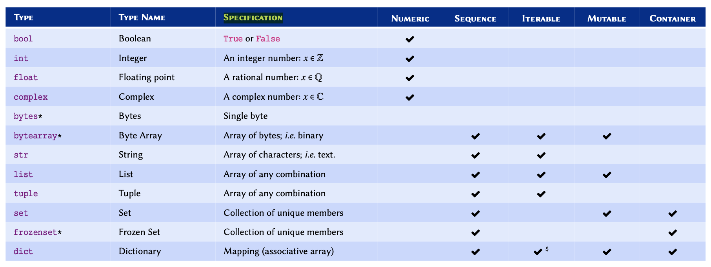
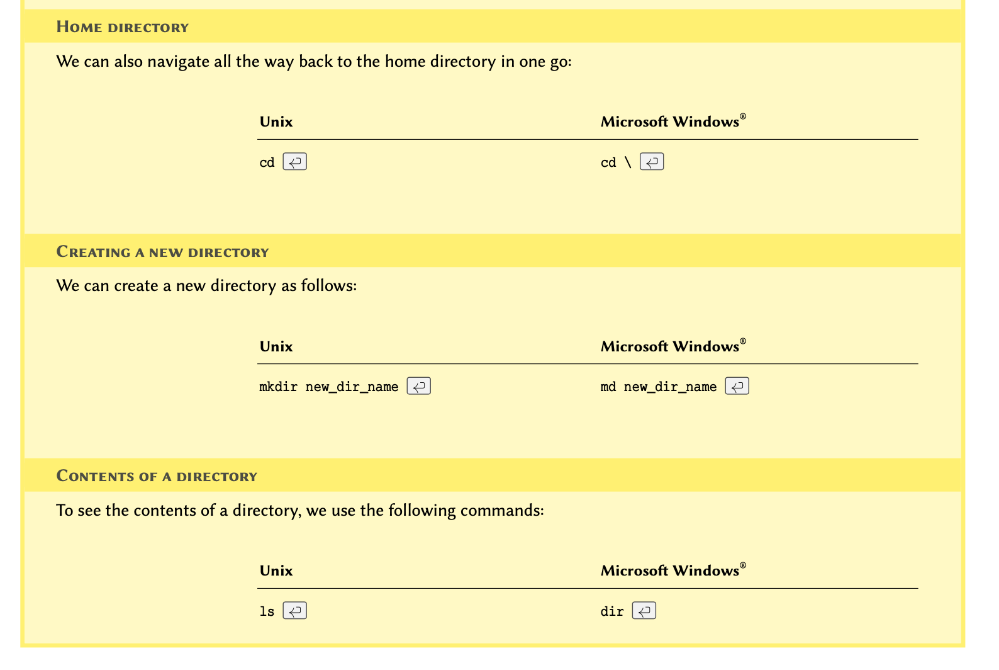

[**Download Chapter PDF (.pdf)**](https://drive.usercontent.google.com/u/1/uc?id=1ir8Nwjbll7Ux4GtXAXdPRu03WL9C-NDI&export=download)

[**Download Chapter notebook (.ipynb)**](https://drive.usercontent.google.com/u/1/uc?id=1Cj3y6wlb13agU7qaAtzpeyomshea41fs&export=download)

[<span style="color: rgb(255, 0, 0);">**Lesson Feedback Survey**</span>](https://docs.google.com/forms/d/e/1FAIpQLSdr0capF7jloJhPH3Pki1B3LZoKOG16poOpuVJ7SL2LkwLHQA/viewform?pli=1)


::::::::::::::::::::::::::::::::::::: questions

- What are input and output (I/O) operations?
- What do variables do?
- Why are types and scopes of variables important?
- What types of operations are used?

::::::::::::::::::::::::::::::::::::::::::::::::

::::::::::::::::::::::::::::::::::::: objectives

- Understanding I/O operations
- Build concepts of different types of variables
- Learning about type conversions and scope
- Understanding mathematical and logical operations
::::::::::::::::::::::::::::::::::::::::::::::::

<p align = "center">
<iframe width="560" height="315" src="https://www.youtube.com/embed/Qr-UBp_AeDA" title="YouTube video player" frameborder="0" allow="accelerometer; autoplay; clipboard-write; encrypted-media; gyroscope; picture-in-picture" allowfullscreen></iframe>
</p>
<br>

<p align = "center">
<iframe width="560" height="315" src="https://www.youtube.com/embed/rCwBVf4_XjM" title="YouTube video player" frameborder="0" allow="accelerometer; autoplay; clipboard-write; encrypted-media; gyroscope; picture-in-picture" allowfullscreen></iframe>
</p>
<br>

<p align = "center">
<iframe width="560" height="315" src="https://www.youtube.com/embed/ht6MSOg0JeA" title="YouTube video player" frameborder="0" allow="accelerometer; autoplay; clipboard-write; encrypted-media; gyroscope; picture-in-picture" allowfullscreen></iframe>
</p>
<br>

<p style='text-align: justify;'>
In programming, we process data and produce outputs. When data is being processed, it is stored in memory so that it is readily available, and can therefore be subject to the processes we want to apply.
</p>


<p style='text-align: justify;'>
In this lesson, we will discuss how to handle data in Python. We will start by displaying data on the screen, and understand how to receive input from a user. We can then use these techniques to perform different mathematical and logical operations. We will also cover the fundamental principles employed every time we code in Python. It is imperative that you understand everything before moving on.
</p>


## I/O Operations {#operations}
<p style='text-align: justify;'>
In computer science, input or output operations refer to the communication between an information processing system such as a computer, and the outside world, which may be a user or even another computer. Such communications are more commonly known as *I/O operations*. In general, this 'outside world' may be loosely defined as anything that falls outside of the coding environment.
</p>

::::::::::::::::::::::::::::::::::::: callout
## REMEMBER
<p style='text-align: justify;'>
Only what we define within the environment and what we store in the memory is directly controlled by our application. We may access or take control over other environments, however, these interactions are classified as I/O operations. An example of this is interacting with a file on our computer. While we have complete control over a file while working on it (e.g. reading from it or writing to it), the access to the file and the transmission of data is in fact controlled and managed not by the programming environment but by the operating system of the computer.
</p>

:::::::::::::::::::::::::::::::::::::


In programming, I/O operations include, but are not limited to:

* Displaying the results of a calculation

* Requiring the user to enter a value

* Writing or reading data to and from a file or a database

* Downloading data from the Internet

* Operating a hardware (such as a robot, for example)


:::::: prereq

## Advanced Topic
<p style='text-align: justify;'>
If you are interested in learning more about I/O systems and how they are handled at operating system level, you might benefit from chapter 13 of [*Operating Systems Concepts, 10^th^ ed.*](https://os.ecci.ucr.ac.cr/slides/Abraham-Silberschatz-Operating-System-Concepts-10th-2018.pdf) by Abraham Silberschatz, Greg Gagne, and Peter Galvin.
</p>

::::::

### **I/O Operations in Python**
[**Input and Output**](https://docs.python.org/3/tutorial/inputoutput.html)

<p style='text-align: justify;'>
In this section, we learn about two fundamental methods of I/O operations in Python. We will be using these methods throughout the course, so it is essential that you feel comfortable with them and the way they work before moving on.
</p>


:::::::::::::::::::::::::::::::::::::::::::::::: discussion
### Producing an output {#sub:ProducingAnOutput}
[**Print**](https://docs.python.org/3/library/functions.html\#print)

<p style='text-align: justify;'>
The term ```output``` in reference to an application typically refers to data that has either been generated or manipulated by that application.
</p>

<p style='text-align: justify;'>
For example; calculating the sum of two numbers. The action of calculating the sum is itself a [*mathematical operation*](#math_ops). The result of our calculation is called its ```output```. Once we obtain the result, we might want to save it in a file or display it on the screen, in which case we will be performing an I/O operation. *I/O operation*.
</p>

<p style='text-align: justify;'>
The simplest and most frequently used method for generating output in almost every modern programming language is to display something on the screen. We recommend using Jupyter Notebooks to run our Python scripts, which defaults to displaying the output of a code cell beneath the code itself. We will start by calling a dedicated built-in function named <kbd>print()</kbd>.
</p>

::::::::::::::::::::::::::::::::::::: callout

## REMEMBER

<p style='text-align: justify;'>
In programming, a ```function``` is essentially an isolated piece of code. It usually accepts input, *does* something to or with this, and produces ```output```. A function can process input, often using several operations in a particular sequence or configuration, and process the input to give a final output. In Python programming syntax, a pair of (typically round) parentheses follows a function, and these provide the function with the *input arguments* it needs when we *call* it, so that it can do what we intend, to our data. We will explore functions in more details in Basic Python 4: [Functions](06-functions.Rmd).
</p>

:::::::::::::::::::::::::::::::::::::

<p style='text-align: justify;'>
The <kbd>print()</kbd> function can take several inputs and performs different tasks. Its primary objective, however, is to take some values as input and display them on the screen. Here is how it works:
</p>

Suppose we want to display some text in the Terminal. To do so, we write the following into a cell of our Jupyter Notebook (or on the Terminal, a code editor or dedicated Integrated Development Environment (IDE)):

```
print('Welcome to L2D!!!')
```
<p style='text-align: justify;'>

This is now a fully functioning Python program that we can run using the Python interpreter.
</p>

<p style='text-align: justify;'>
If you are using an IDE (such as Mircosoft Visual Studio Code, for example) you must save the code in a file with the extension ```.py```, in order to execute your code using the internal tools provided by that IDE. The specifics of how you do so depend on the IDE that you are using.
</p>

<p style='text-align: justify;'>
```.py``` Python scripts can also be executed manually. To do so, we open the Terminal in MacOS or Linux or the command prompt (CMD) in Windows and navigate to the directory where we saved the script.
</p>

:::::: prereq

## NOTE
<p style='text-align: justify;'>
If you don't know how to navigate in the Terminal, see the example in section [How to use terminal environment?](#terminal) at the end of this chapter.
</p>

::::::

Once in the correct directory, we run a script called ```script_a.py``` by typing ```python3 script_a.py``` in our Terminal as follows:


``` bash
python3 script_a.py
```


Hello world!

<p style='text-align: justify;'>
This will call the Python 3 interpreter to execute the code we wrote in ```script_a.py```. Once executed, we will see the output displayed in the Terminal window.
</p>

<p style='text-align: justify;'>
In a Jupyter Notebook we can press the keyboard shortcut 'shift+enter' to execute the code in a cell. The output will be displayed below the code cell.
</p>

<p style='text-align: justify;'>
You have now successfully written and executed your first program in Python.
</p>

::::::::::::::::::::::::::::::::::::::::::::::::

::::::::::::::::::::::::::::::::::::: callout
## REMEMBER

<p style='text-align: justify;'>
We know that <kbd>print()</kbd> is a *function* because it ends with a pair of parentheses, and it is written entirely in lowercase characters [PEP-8: Function Names](https://www.python.org/dev/peps/pep-0008/#function-names). Some IDEs change color when they encounter built-in functions, in order to signal to the user that the function is recognised, and available to use, and so that we don’t accidentally overwrite them. 
</p>

:::::::::::::::::::::::::::::::::::::


<p style='text-align: justify;'>
We can pass more than a single value to the <kbd>print()</kbd> function, provided that each value is separated from another, using a comma. For instance, if we write the code below and run the script, the results would be as shown in *output*.
</p>


``` python
print('Hello', 'John')
```

Hello John

<p style='text-align: justify;'>
Notice that there is a space between <span style="color: rgb(32, 121, 77);">'Hello'</span> and <span style="color: rgb(32, 121, 77);">'John'</span> even though we did not include a space in our text. This is the default behaviour of the <kbd>print()</kbd> function when it receives more than a single value (argument).
</p>

This default behaviour may be changed using a keyword argument called sep:


``` python
print('Hello', 'John', sep='')
```

HelloJohn


``` python
print('Hello', 'John', sep='--')
```

Hello--John


``` python
print('Jane', 21, 'London', sep='.')
```

Jane.21.London


::::::::::::::::::::::::::::::: challenge

## Practice Exercise 1

Write code that displays the following output:

>**Protein Kinase C (Alpha subunit)**


::::::::::::::::: solution

## ANSWER


``` python
print('Protein Kinase C (Alpha subunit)')
```

Protein Kinase C (Alpha subunit)

:::::::::::::::::

:::::::::::::::::::::::::::::::

{#fig:terLinux}

{#fig:terMac}

:::::::::::::::::::::::::::::::::::::::::::::::: discussion
### Receiving an input
[**Input**](https://docs.python.org/3/library/functions.html\#input)

<p style='text-align: justify;'>
Inputs are I/O operations that involve receiving some data from the outside world. This might include reading the contents of a file, downloading something from the internet, or asking the user to enter a value.
</p>

<p style='text-align: justify;'>
The simplest way to acquire an input is to ask the user to enter a value in the Terminal. To do so, we use a dedicated built-in function called <kbd>input()</kbd>.
</p>

::::::::::::::::::::::: callout
## Note
In a Unix system (Mac OS or Linux), a tilde (~) is an alias that is used to refer to a user's home directory.
:::::::::::::::::::::::

<p style='text-align: justify;'>
This function takes a single *argument* called ```prompt```. Prompt is the text displayed in the Terminal to ask the user for an input. Figure [Terminal window on a Linux computer](#fig:terLinux) and [Terminal window on a Mac](#fig:terMac), illustrates a screen shot of an example PC's prompt, where it displays a user name (i.e. ```pouria```) followed by a tilde (~). A Terminal prompt may be different in each computer and operating system.
</p>

Here is how we implement the <kbd>input()</kbd> function:

```
input('Please enter your name: ')
```

which is exactly the same as:

```
input(prompt='Please enter your name: ')
```

If we save one of the above in a notebook and execute it, we will see:


```
python3 script_b.py

Please enter your name: _
```

<p style='text-align: justify;'>
The Terminal cursor, displayed as an underscore in our example, will be in front of the prompt (i.e. ```'Please enter your name: '```) waiting for a response. Once it receives a response, it will proceed to run the rest of the code (if any), or terminate the execution.
</p>

<p style='text-align: justify;'>
We may store the user's response in a variable. Variables are the topic of the next episode in this learning material, where we shall also review more examples on <kbd>input()</kbd> and how we can use it to produce results based on the responses we receive from the user.
</p>

::::::::::::::::::::::::::::::::::::::::::::::::


::::::::::::::::::::::::::::::: callout

## Remember
<p style='text-align: justify;'>
Python is an interpreted language; this means that the code we write is executed by the Python interpreter one line at a time. The <kbd>input()</kbd> function performs a *blocking* process. This means that the execution of the code by the Python interpreter is halted upon encountering an <kbd>input()</kbd> function until the user enters a value. Once a value is entered, the interpreter then proceeds to execute the next line.
</p>

:::::::::::::::::::::::::::::::

::::::::::::::::::::::::::::::: challenge
## Practice Exercise 2

Write a script that asks the user to enter the name of a protein in the Terminal.

::::::::::::::::::: solution
## ANSWER

```
input('Please enter the name of a protein: ')
```

:::::::::::::::::::
:::::::::::::::::::::::::::::::

## Variables And Types {#varTypes}

<p style='text-align: justify;'>

Variables are a type of data container, that we can use to store data to memory. Each variable has three main types of attribute: *scope*, *name*, and *type*. *Scope* and *name* must be mutually unique. Starting with *name*, we will discuss each of these attributes in more details throughout this chapter.
</p>

### **Variable names** {#subsec:variableNames}
[**PEP--8 Naming Conventions**](https://www.python.org/dev/peps/pep-0008/\#naming-conventions)

<p style='text-align: justify;'>
The name that we give to a variable is, in fact, an alias for a location in the memory. You can think of it as a postbox, which is used as a substitute for an actual address. Similarly, we use variable names so we don't have to use the actual address to the location we want in the memory; because it would look something like this ```0x106fb8348```.
</p>

There are some relatively simple rules to follow when defining variable names, which ultimately boil down to:


::::::::::::::::::::::: callout

## Remember
<p style='text-align: justify;'>
We should never overwrite an existing, built-in definition or identifier (e.g. ```int``` or  ```print```). We will be learning many such definitions and identifiers as we progress through this course. Nonetheless, the Jupyter Notebook as well as any good IDE highlights syntaxes and built-in identifiers in different colours. In Jupyter, the default for built-in definitions is green. The exact colouring scheme depends on the IDE being used, and the selected theme.
</p>

:::::::::::::::::::::::

Once a variable is defined, its value may be altered or reset:


``` python
total_items = 2
print(total_items)
```

2

In Python, variables containing integer numbers are referred to as ```int```, and those containing decimal numbers are referred to as ```float```.


``` python
total_items = 3
print(total_items)
```

3


``` python
total_values = 3.2
print(total_values)
```

3.2


``` python
temperature = 16.
print(temperature)
```

16.0

<p style='text-align: justify;'>
Variables can contain data as characters as well; but to prevent Python from confusing them with meaningful commands, we use  quotation marks. So long as we remain consistent, _it doesn't matter whether we use single or double quotations_. These data are known as ```string``` or  ```str```:
</p>


``` python
forename = 'John'
surname = "Doe"


print('Hi,', forename, surname)
```

Hi, John Doe


::::::::::::::::::::::::::::::: challenge

## Practice Exercise 3 {#diy:enzyme}
<p style='text-align: justify;'>
Oxidised low-density lipoprotein (LDL) receptor 1 mediates the recognition, internalisation and degradation of oxidatively modified low-density lipoprotein by vascular endothelial cells. Using the [Universal Protein Resource](https://beta.uniprot.org) (UniProt) website, find this protein for humans, and identify:
</p>

* UniProt entry number.
* Length of the protein (right at the top).
* Gene name (right at the top).

Store the information you retrieved, including the protein name, in within four separate variables.

Display the values of these four variables in *one* line, and separate the items with three spaces, as follows:

> ```Name   EntryNo   GeneName   Length```

::::::::::::::: solution

## ANSWER


``` python
name = 'Oxidised low-density lipoprotein (LDL) receptor 1'

uniprot_entry = 'P78380'

gene_name = 'OLR1'

length = 273

print(name, uniprot_entry, gene_name, length, sep='   ')
```

Oxidised low-density lipoprotein (LDL) receptor 1   P78380   OLR1   273

:::::::::::::::

:::::::::::::::::::::::::::::::

::::::::::::::::::::::::::::::: challenge

## Practice Exercise 4
1. Write a Python code that upon execution, asks the user to enter the name of an enzyme and then stores the response in an appropriately named variable.

2. Use the variable to display an output similar to the following:

```ENZYME_NAME is an enzyme.```

where ```ENZYME_NAME``` is the name of the enzyme entered in the prompt.

3. Now modify your script to prompt the user to enter the number of amino acids in that enzyme. Store the value in another appropriately named variable.

4. Alter the output of your script to display a report in the following format:

```ENZYME_NAME is an enzyme containing a total number of AMINO_ACIDS} amino acids.```

where ```AMINO_ACIDS``` is the number of amino acids.

::::::::::::::: solution

## ANSWER

```
enzyme = input('Please enter the name of an enzyme: ')

print(enzyme, 'is an enzyme.')

length = input('How many amino acids does the enzyme contain? ')

print(enzyme, 'is an enzyme containing a total number of', length, 'amino acids.')

```

:::::::::::::::

:::::::::::::::::::::::::::::::


### **Variable Types** {#sec:varTyp}
[**Built-in Types**](https://docs.python.org/3/library/stdtypes.html)

When it comes to types, programming languages may be divided into two distinct categories:

:::::::::::::::::::: checklist
## Types

- [x] **Statically typed** languages: these require the programmer to explicitly declare the type of each variable, and this type is checked at compile time.

- [x] **Dynamically typed** languages: the type of the variable is determined at run time, and variables can change types on the fly. The programmer is not required to explicitly define the type of a variable: the language infers the type of the variable, once it is assigned data.

<p style='text-align: justify;'>
Python is a dynamically typed language, and falls into this second category. This means that, unlike statically typed languages, we rarely need to worry about the *type* definitions because in the majority of cases, Python takes care of them for us, and automatically decodes the type of data being stored in a variable, once it is defined by the user.
</p>

::::::::::::::::::::


::::::::::::::::::::::: callout
## Remember
<p style='text-align: justify;'>
In a dynamically typed language, it is the value of a variable that determines the type. This is because the types are determined on the fly by the Python interpreter as and when it encounters different variables and values.
</p>

:::::::::::::::::::::::

::::::::::::::::::::::: prereq
## Advanced Topic
<p style='text-align: justify;'>
In computer programming, type systems are syntactic methods to enforce and/or identify levels of abstraction. This means that type systems take advantage of the syntax of a particular programming language, in order to enforce rules and identify types. This is important, as it can manage abstraction in data, by ensuring that differing data types interact meaningfully with one another. An entire field in computer science has been dedicated to the study of programming languages from a type--theoretic approach. This is primarily due to the implication of types and their underlying principles in such areas in software engineering as optimisation and security. To learn more about the study of type systems, refer to: Pierce B. Types and programming languages. Cambridge, Mass.: MIT Press; 2002.
</p>

:::::::::::::::::::::::

::::::::::::::::::::::: callout
## Note
<p style='text-align: justify;'>
The values determine the type of a variable in dynamically typed languages. This is in contrast to statically typed languages, where a variable must be initialised using a specific type before a value. 
</p>

:::::::::::::::::::::::


#### **Why learn about *types* in a dynamically typed programming language?**
<p style='text-align: justify;'>
</p>

<p style='text-align: justify;'>
Python enjoys a powerful type system out of the box. The following table - [Built-in types in Python](#tb:types:nativeTypes) - provides a comprehensive reference for the built-in types in Python. Built-in types already exist in the language, and do not require the use or implementation of any third-party libraries.
</p>

{#tb:types:nativeTypes}
A comprehensive (but non-exhaustive) reference of built-in (native) types in Python 3.<br> ^\*^ Not discussed in this course --- included for reference only. <br> ^$^ ```dict``` is not an iterable by default, however, it is possible to iterate through its keys. 

<br> <br>**Mutability** is an important [concept in programming](https://en.wikipedia.org/wiki/Immutable_object). A mutable object is an object whose value(s) may be altered. This will become clearer once we study ```list``` and ```tuple```. Find out more about mutability in Python from the [documentation](https://docs.python.org/3.9/reference/datamodel.html). <br> <br>
**Complex numbers** refer to a [set of numbers](http://thinkzone.wlonk.com/Numbers/NumberSets.htm) that have both a real component, and an imaginary component; where the imaginary part is defined as $\sqrt{-1}$. These numbers are very useful in the study of oscillatory behaviours and flow (e.g. heat, fluid, electricity). To learn more about complex numbers, watch this [Khan Academy video tutorial](https://www.khanacademy.org/math/algebra2/introduction-to-complex-numbers-algebra-2/the-complex-numbers-algebra-2/v/complex-number-intro). 


Sometimes we might need want to explicitly know what the type of a variable is. To do this, we can use the build-in function <kbd>type()</kbd> as follows:


``` python
total_items = 2

print(type(total_items))
```

<class 'int'>


``` python
total_values = 3.2

print(type(total_values))
```

<class 'float'>


``` python
temperature = 16.

print(type(temperature))
```

<class 'float'>


``` python
phase = 12.5+1.5j

print(type(phase))
```

<class 'complex'>


``` python
full_name = 'John Doe'

print(type(full_name))
```

<class 'str'>

:::::::::::::::::: callout
## Remember
<p style='text-align: justify;'>
In Python, a variable/value of a certain type may be referred to as an *instance* of that type. For instance, an integer value whose type in Python is defined as *int* is said to be an **instance of type** ```int```.
</p>

::::::::::::::::::

::::::::::::::::::::::::::::::: challenge

## Practice Exercise 5
Determine and display the type for each of these values:

* 32
* 24.3454
* 2.5 + 1.5
* "RNA Polymerase III"
* 0
* .5 - 1
* 1.3e-5
* 3e5

The result for each value should be represented in the following format:

```Value X is an instance of <class 'Y'>```

::::::::::::::: solution

## ANSWER


``` python
value = 32

value_type = type(value)

print('Value', value, 'is an instance of', value_type)
```

Value 32 is an instance of <class 'int'>


``` python
value = 24.3454

value_type = type(value)

print('Value', value, 'is an instance of', value_type)
```

Value 24.3454 is an instance of <class 'float'>


``` python
value = 2.5 + 1.5

value_type = type(value)

print('Value', value, 'is an instance of', value_type)
```

Value 4.0 is an instance of <class 'float'>


``` python
value = "RNA Polymerase III"

value_type = type(value)

print('Value', value, 'is an instance of', value_type)
```

Value RNA Polymerase III is an instance of <class 'str'>


``` python
value = 0

value_type = type(value)

print('Value', value, 'is an instance of', value_type)
```

Value 0 is an instance of <class 'int'>


``` python
value = .5 - 1

value_type = type(value)

print('Value', value, 'is an instance of', value_type)
```

Value -0.5 is an instance of <class 'float'>


``` python
value = 1.3e-5

value_type = type(value)

print('Value', value, 'is an instance of', value_type)
```

Value 1.3e-05 is an instance of <class 'float'>


``` python
value = 3e5

value_type = type(value)

print('Value', value, 'is an instance of', value_type)
```

Value 300000.0 is an instance of <class 'float'>
:::::::::::::::

:::::::::::::::::::::::::::::::


### **Conversion of types** {#sec:conversionType}

:::::::::::::::::::::::::::::::::::::::::::::::: discussion

## Why convert types?
<p style='text-align: justify;'>
It is sometimes necessary to have the values returned by the <kbd>input()</kbd> function --- *i.e*. the user's response, in other types. Imagine the following scenario:
</p>

<p style='text-align: justify;'>
<span style="color: rgb(32, 121, 77);">
"We ask our user to enter the total volume of their purified protein, so that we can work out the amount of assay they need to conduct a specific experiment. To calculate this assay volume using the volume of the purified protein, we need to perform mathematical calculations based on the response we receive from our user. It is not possible to perform mathematical operations on non-numeric values. Therefore, we ought to somehow convert the type from ```str``` to a numeric type."
</span>
</p>

<p style='text-align: justify;'>
The possibility of converting from one type to another depends entirely on the *value*, the *source type*, and the *target type*. For instance; we can convert an instance of type ```str``` (source type) to one of type ```int``` (target type) if and only if the source value consists entirely of numbers and there are *no* other characters.
</p>

::::::::::::::::::::::::::::::::::::::::::::::::

::::::::::::::::::: callout

## Remember
<p style='text-align: justify;'>
To convert a variable from one type to another, we use the *Type Name* of the target type (as described in Table [Built-in types in Python](#tb:types:nativeTypes) and treat it as a function.
</p>

For instance, to convert a variable to integer, we:

* look up the *Type Name* for integer from Table [Built-in types in Python](#tb:types:nativeTypes)
* then treat the *Type Name* as a function: ```int()```
* use the function to convert our variable: new_var = ```int```(old_var)

:::::::::::::::::::

Here is an example of how we convert types in Python:


``` python
value_a = '12'

print(value_a, type(value_a))
```

12 <class 'str'>


``` python
value_b = int(value_a)

print(value_b, type(value_b))
```

12 <class 'int'>

If we attempt to convert a variable that contains non-numeric values, a ```ValueError``` is raised:


``` python
value_a = '12y'

print(value_a, type(value_a))
```

12y <class 'str'>


``` python
value_b = int(value_a)
```

ValueError: invalid literal for int() with base 10: '12y'

::::::::::::::::::::::::::::::: challenge

## Practice Exercise 6
<p style='text-align: justify;'>
In programming, we routinely face errors resulting from different mistakes. The process of finding and correcting such mistakes in the code is referred to as **debugging**.
</p>

We have been given the following piece of code written in Python:
```
value_a = 3
value_b = '2'

result = value_a + value_b
print(value_a, '+', value_b, '=', result)
```
But when the code is executed, we encounter an error message as follows:

```
Traceback (most recent call last):
File "<stdin>", line 1, in <module>
TypeError: unsupported operand type(s) for +: 'int' and 'str'
```

Debug the snippet so that the correct result is displayed:


> ```3 + 2 = 5```


:::::::::::::::::: solution

## ANSWER


``` python
value_a = 3

value_b = '2'

result = value_a + int(value_b)

print(value_a, '+', value_b, '=', result)
```

3 + 2 = 5
::::::::::::::::::

:::::::::::::::::::::::::::::::

### **Handling Input Variables**

::::::::::::::::::::::::::::::: discussion
<p style='text-align: justify;'>
When we use <kbd>input()</kbd> to obtain a value from the user, the results are by default an instance of type ```str```. An <kbd>input()</kbd> function always stores the response as a ```str``` value, no matter what the user enters. However, it is possible to convert the type afterwards.
</p>

:::::::::::::::::::::::::::::::

:::::::::::::: callout

## Remember
<p style='text-align: justify;'>
The <kbd>input()</kbd> function *always* returns a value of type ```str``` regardless of the user's response. In other words, if a user's response to an <kbd>input()</kbd> request is numeric, Python will *not* automatically recognise it as a numeric type.
</p>

::::::::::::::

We may use *type conversion* in conjunction with the values returned by the <kbd>input()</kbd> function:

```
response = input('Please enter a numeric value: ')

response_numeric = float(response)

print('response:', response)
print('response type:', type(response))
print('response_numeric:', response_numeric)
print('response_numeric type:', type(response_numeric))
```

<p style='text-align: justify;'>
The output shows the results when we enter numeric values as directed.
</p>


::::::::::::::::::::::::::::::::::: challenge
## Practice Exercise 7
<p style='text-align: justify;'>
We know that each amino acid in a protein is encoded by a triplet of mRNA nucleotides.
</p>

<p style='text-align: justify;'>
With that in mind, alter the script you wrote for [Practice Exercise 3](#diy:enzyme) and use the number of amino acids entered by the user to calculate the number of mRNA nucleotides.
</p>

Display the results in the following format:

> ```ENZYME_NAME is an enzyme with AMINO_ACIDS amino acids and NUCLEOTIDES nucleotides.```

where ```NUCLEOTIDES``` is the total number of mRNA nucleotides that you calculated.

**Note:** Multiplication is represented using the asterisk (```*```) sign.

::::::::::::: solution

## ANSWER

```
enzyme = input('Please enter the name of an enzyme: ')

length = input('How many amino acids does the enzyme contain? ')

nucleotides = 3 * int(length)

print(enzyme, 'is an enzyme with', length, 'amino acids and',  nucleotides, 'nucleotides.')

```

:::::::::::::

:::::::::::::::::::::::::::::::::::

### **Variable scopes**
[**Resolution of names**](https://docs.python.org/3.6/reference/executionmodel.html\#resolution-of-names)
<p style='text-align: justify;'>
When defining a variable, we should always consider where in our program we intend to use it. The more localised our variables, the better. This is because local variables are easier to distinguish, and thus reduce the chance of making mistakes --- e.g. unintentionally redefining or altering the value of an existing variable.
</p>

<p style='text-align: justify;'>
Therefore, the scope of a variable defines the ability to reference a variable from different *points* in our programs. The concept of local variables becomes clearer once we explore functions in programming in chapter [Functions](06-functions.Rmd).
</p>

<p style='text-align: justify;'>
As displayed in Figure [Variable scopes](#fig:opts:scopes), the point *at* or *from* which a variable can be referenced depends on the location where the variable is defined.
</p>

In essence, there are three general rules to remember in relation to variable scopes in Python:

<p style='text-align: justify;'>
I. A variable that is defined in the outer scope, can be *accessed* or *called* in the inner scopes, but it cannot be *altered* implicitly. Not that such variables may still be altered using special techniques (not discussed).
</p>

<p style='text-align: justify;'>
II. A variable that is defined in the innermost scopes (local), can only be *accessed*, *called*, or *altered* within the boundaries of the scope it is defined in.
</p>

<p style='text-align: justify;'>
III. The inner scopes *from* which a variable is referenced must themselves be contained within the defining scope --- e.g. in ```FuncB``` of Figure [Variable scopes](#fig:opts:scopes), we can reference ```a```, ```b```, and ```x```; but not ```f1```. This is because the scope of ```f1``` is ```Script``` <kbd>→</kbd> ```FuncA```, so it can only be referenced from ```Script```  <kbd>→</kbd> ```FuncA``` <kbd>→ ...</kbd>, but not  ````Script```<kbd>→  ...</kbd> or ```Script``` <kbd>→</kbd>  ```FuncB``` <kbd>→ ...</kbd>.
</p>

{#fig:opts:scopes}
<p style='text-align: justify;'>
As we discussed earlier in this lesson, it is paramount to remember that Python is an interpreted language. This means that the Python interpreter goes through the codes that we write line by line, interpreting it to machine language. It is only then that the commands are processed and executed by the computer. On that account, a variable (or a function) can be referenced only *after* its initial definition. That is why, for instance, in ```Script (part 2)``` of Figure [Variable scopes](#fig:opts:scopes), we can reference every variable and function except for ```FuncC```, which is declared further down in the code hierarchy.
</p>

<p style='text-align: justify;'>
Although scope and hierarchy appear at first glance as theoretical concepts in programming, their implications are entirely practical. The definition of these principles vary from one programming language to another. As such, it is essential to understand these principles and their implications in relation to any programming language we are trying to learn.
</p>

### **Optional: How to use Terminal environment?** {#terminal}




## Operations {#sec:operations}
<p style='text-align: justify;'>
Through our experimentation with [variable types](#sec:varTyp), we already know that variables may be subjected to different operations.
</p>

<p style='text-align: justify;'>
When assessing [type conversions](#sec:conversionType), we also established that the operations we can apply to each variable depend on the *type* of that variable. To that end, we learned that although it is sometimes possible to mix variables from different types to perform an operation (for example multiplying a floating point number with an integer), there are some logical restrictions in place.
</p>

<p style='text-align: justify;'>
Throughout this section, we will take a closer look into different types of operations in Python. This will allow us to gain a deeper insight, and to familiarise ourselves with the underlying logic.
</p>

<p style='text-align: justify;'>
To recapitulate on what we have done so far, we start off by reviewing *additions* --- the most basic of all operations.
</p>

Give the variable ```total_items```:

``` python
total_items = 2

print(total_items)
```

2


We can increment the value of an *existing* variable by ```1``` as follows:


``` python
total_items = total_items + 1

print(total_items)
```

3

<p style='text-align: justify;'>
Given two different variables, each containing a different value; we can perform an operation on these values and store the result in *another* variable without altering the original variables in any way:
</p>


``` python
old_items = 4
new_items = 3

total_items = old_items + new_items

print(total_items)
```

7

<p style='text-align: justify;'>
We can change the value of an *existing* variable using a value stored in *another* variable:
</p>


``` python
new_items = 5
total_items = total_items + new_items

print(total_items)
```

12

There is also a shorthand method for applying this operation on an *existing* variable:


``` python
total_items = 2

print(total_items)
```

2


``` python
total_items += 1

print(total_items)
```

3


``` python
new_items = 5
total_items += new_items

print(total_items)
```

8

<p style='text-align: justify;'>
As highlighted in the [introduction](#sec:operations), different operations may be applied to any variable or value. We can now explore the most fundamental operations in programming, and learn about their implementation in Python.
</p>

::::::::::::::::::: callout
## Remember
<p style='text-align: justify;'>
There are 2 very general categories of operations in programming: *mathematical*, and *logical*. Naturally, we use mathematical operations to perform calculations, and logical operations to perform tests.
</p>

:::::::::::::::::::

### **Mathematical Operations** {#math_ops}

Suppose ```a``` and ```b``` are two variables representing integers, as follows:

```
a = 17
b = 5
```

Using ```a``` and ```b``` we can itemise built-in mathematical operations in Python as follows:

{#fig:nativeTypes}

::::::::::::::::::: callout

## Remember
<p style='text-align: justify;'>
As far as mathematical operations are concerned, variables ```a``` and ```b``` may be an instance of any *numeric* type. See Table [Routine mathematical operations in Python](#fig:nativeTypes) to find out more about numeric types in Python.
</p>

Values of type ```int``` have been chosen in our examples to facilitate the understanding of the results.

:::::::::::::::::::


::::::::::::::::::::::::::::::::::::: challenge

## Practice Exercise 8 {#diy:mathsI}

1. Calculate the following and store the results in appropriately named variables:

  a. $5.8 \times 3.3$
  b. $\frac{180}{6}$
  c. $35 - 3.0$
  d. $35 - 3$
  e. $2^{1000}$

Display the result of each calculation -- including the type, in the following format:

> ```Result: X is an instance of <class 'Y'>```


2. Now using the results you obtained:
<p style='text-align: justify;'>
  **I.** Can you explain why the result of $35 - 3.0$ is an instance of type ```float```, whilst that of $35 - 3$ is of type ```int```?
</p>

<p style='text-align: justify;'>
  **II.** Unlike the numeric types, string values have a length. To obtain the length of a string value, we use <kbd>len()</kbd>. Convert the result for $2^{1000}$ from ```int``` to ```str```, then use the aforementioned function to work out the length of the number --- i.e. how many digits is it made of?
</p>

<p style='text-align: justify;'>
If you feel adventurous, you can try this for $2^{10000}$ or higher; but beware that you might overwhelm your computer and need a restart it if you go too far (i.e. above $2^{1000000}$). Just make sure you save everything beforehand, so you don't accidentally lose your work.
</p>

<p style='text-align: justify;'>
**Hint:** We discuss <kbd>len()</kbd> in our [subsection of arrays](04-arrays.Rmd) arrays lesson. However, at this point, you should be able to use the official function documentation to figure out how it works. To access a function’s documentation or docstring within Jupyter Notebook, for example you can use `help(function_name)`  to reveal it’s documentation. Clicking within the function (for example, placing your cursor inside the function `len`) and using `shift+tab` can also be an easy shortcut for viewing a function’s docstring.
</p>

::::::::::::::::::::: solution

## Q1

``` python
q1_a = 5.8 * 3.3
print('Result:', q1_a, 'is an instance of', type(q1_a))
```

Result: 19.139999999999997 is an instance of <class 'float'>

``` python
q1_b = 180 / 6
print('Result:', q1_b, 'is an instance of', type(q1_b))
```

Result: 30.0 is an instance of <class 'float'>

``` python
q1_c = 35 - 3.0
print('Result:', q1_c, 'is an instance of', type(q1_c))
```

Result: 32.0 is an instance of <class 'float'>

``` python
q1_d = 35 - 3
print('Result:', q1_d, 'is an instance of', type(q1_d))
```

Result: 32 is an instance of <class 'int'>

``` python
q1_e = 2 ** 1000
print('Result:', q1_e, 'is an instance of', type(q1_e))
```

Result: 10715086071862673209484250490600018105614048117055336074437503883703510511249361224931983788156958581275946729175531468251871452856923140435984577574698574803934567774824230985421074605062371141877954182153046474983581941267398767559165543946077062914571196477686542167660429831652624386837205668069376 is an instance of <class 'int'>


:::::::::::::::::::::

::::::::::::::::::::: solution
## Q2-I
<p style='text-align: justify;'>
In the case of $35 - 3.0$ vs $35 - 3$, the former includes a floating point number. Operations involving multiple numeric types always produce the results as an instance of the type that covers all of the operands -- i.e. ```float``` covers ```int```, but not vice-versa.
</p>

:::::::::::::::::::::

::::::::::::::::::::: solution

## Q2-II


``` python
big_num = 2 ** 1000
big_num_str = str(big_num)
big_num_len = len(big_num_str)

print('Length of 2**1000:', big_num_len)
```

Length of 2**1000: 302

:::::::::::::::::::::

:::::::::::::::::::::::::::::::::::::


:::::::::::::::::::::::: callout
## Interesting Fact
<p style='text-align: justify;'>
As of Python 3.6, you can use an underscores (``` _ ```) *within* large numbers as a separator to make them easier to read in your code. For instance, instead of ```x = 1000000```, you can write ```x = 1_000_000```.
</p>

::::::::::::::::::::::::


#### **Shorthand:**
<p style='text-align: justify;'>
When it comes to mathematical operations in Python, there is a frequently used shorthand method that every Python programmer should be familiar with.
</p>

<p style='text-align: justify;'>
Suppose we have a variable defined as ```total_residues = 52``` and want to perform a mathematical operation on it. However, we would like to store the result of that operation in ```total_residues``` instead of a new variable. We can do this as follows:
</p>


``` python
total_residues = 52

# Addition:
total_residues += 8

print(total_residues)
```

60


``` python
# Subtraction:
total_residues -= 10

print(total_residues)
```

50


``` python
# Multiplication:
total_residues *= 2

print(total_residues)
```

100


``` python
# Division:
total_residues /= 4

print(total_residues)
```

25.0


``` python
# Floor quotient:
total_residues //= 2

print(total_residues)
```

12.0


``` python
# Remainder:
total_residues %= 5

print(total_residues)
```

2.0


``` python
# Power:
total_residues **= 3

print(total_residues)
```

8.0

We can also perform such operations using multiple variables:


``` python
total_residues = 52
new_residues = 8
number_of_proteins = 3

total_residues += new_residues

print(total_residues)
```

60


``` python
total_residues += (number_of_proteins * new_residues)

print(total_residues)
```

84


::::::::::::::::::::::::::::::::::::: challenge

## Practice Exercise 9 {#diy:mathsII}

1. Given:
	* Circumference: $C = 18.84956$
	* Radius: $R = 3$

and considering that the properties of a circle are defined as follows:


$$\pi = \frac{C}{D}$$
calculate $\pi$ using the above equation and store it in a variable named ```pi```:


Then round the results to 5 decimal places and display the result in the following format:

>```The value of pi calculated to 5 decimal places: X.XXXXX```

<p style='text-align: justify;'>
**Note: **To round floating point numbers in Python, we use the function <kbd>round()</kbd>. This is a built-in function that takes two input arguments: the first is the variable/value to be rounded, and the second is the number of decimal places we wish to round to. Read more about the <kbd>round()</kbd> function in its [official documentation](https://docs.python.org/3/library/functions.html#round).
</p>

2. Now without creating a new variable, perform the following operation:

	$$pi = \frac{pi}{(3 \bmod 2) - 1}$$


where the expression ''$3 \bmod 2$'' represents the remainder for the division of 3 by 2.

Explain the output.

::::::::::::::::::::: solution
## Q1


``` python
c = 18.84956
r = 3
d = r * 2

pi = c / d

print('The value of pi calculated to 5 decimal places:', round(pi, 5))
```

The value of pi calculated to 5 decimal places: 3.14159

:::::::::::::::::::::

::::::::::::::::::::: solution
## Q2
```
	pi /= (3 % 2) - 1

```

The calculation raises a ```ZeroDivisionError```. This is because division by zero is mathematically impossible.
:::::::::::::::::::::

:::::::::::::::::::::::::::::::::::::

#### **Precedence:**
<p style='text-align: justify;'>
In mathematics and computer programming, there are a series of conventional rules on the precedence of procedures to evaluate a mathematical expression. This collection of rules is referred to as the *order of operation* or *operator precedence*.
</p>

Suppose we have a mathematical expression as follows:

$$x = 2 + 3 \times 9$$
<p style='text-align: justify;'>
Such an expression can *only* be evaluated correctly if we do the multiplication first and then perform the addition. This means that the evaluation is done as follows:
</p>

$$given:3 \times 9  = 27$$
$$\implies x = 2 + 27$$
$$ = 29$$

For instance, in an expression such as:


$$x = 2 \times (3 + (5 - 1)^2)$$


the evaluation workflow may be described as follows:


$$x = 2 \times (3 + 4^2)$$
$$ = 2 \times (3 + 16)$$
$$ = 38$$
<p style='text-align: justify;'>
The same principle applies in Python. This means that if we use Python to evaluate the above expression, the result would be identical:
</p>


``` python
result = 2 * (3 + (5 - 1) ** 2)

print(result)
```

38


::::::::::::::::::::: callout
## Remember
Operator precedence in mathematical operations may be described as follows:

1. Exponents and roots
2. Multiplication and division
3. Addition and subtraction

If there are any parentheses ```( )``` in the expression, the expression is evaluated from the innermost parenthesis, outwards.

:::::::::::::::::::::

::::::::::::::::::::::::::::::::::::: challenge

## Practice Exercise 10
Display the result of each item in the following format:

```
EXPRESSION = RESULT
```

For example:

```
	2 + 3 = 5
```


1. Calculate each expression *without* using parentheses:

  a. $3 \times \frac{2}{4}$
  b. $5 + 3 \times \frac{2}{4}$
  c. $3 \times \frac{2}{4} + 5$
  d. $\frac{2}{4} \times 3$


2. Calculate these expressions *using* parentheses:

  a. $5 + \frac{2}{4} \times 3$
  b.  $5 + \frac{2 \times 3}{4}$
  c. $5 + \frac{2}{4 \times 3}$


3.  Given

```
a = 2
b = 5
```

use ```a``` and ```b``` to calculate the following expressions:

  a. $(a + b)^2$
  b. $a^2 + 2ab + b^2$

::::::::::::::::::::: solution

## Q1

``` python
q1_a = 3 * 2 / 4
print('3 * 2 / 4 =', q1_a)
```

3 * 2 / 4 = 1.5

``` python
q1_b = 5 + 3 * 2 / 4
print('5 + 3 * 2 / 4 =', q1_b)
```

5 + 3 * 2 / 4 = 6.5

``` python
q1_c = 3 * 2 / 4 + 5
print('3 * 2 / 4 + 5 =', q1_c)
```

3 * 2 / 4 + 5 = 6.5

``` python
q1_d = 2 / 4 * 3
print('2 / 4 * 3 =', q1_d)
```

2 / 4 * 3 = 1.5

:::::::::::::::::::::

::::::::::::::::::::: solution
## Q2


``` python
q2_a = 5 + (2 / 4) * 3
print('5 + (2 / 4) * 3 =', q2_a)
```

5 + (2 / 4) * 3 = 6.5

``` python
q2_b = 5 + (2 * 3) / 4
print('5 + (2 * 3) / 4 =', q2_b)
```

5 + (2 * 3) / 4 = 6.5

``` python
q2_c = 5 + 2 / (4 * 3)
print('5 + 2 / (4 * 3) =', q2_c)
```

5 + 2 / (4 * 3) = 5.166666666666667

:::::::::::::::::::::

::::::::::::::::::::: solution

## Q3


``` python
a = 2
b = 5

q3_a = (a + b) ** 2
print('(a + b)^2 =', q3_a)
```

(a + b)^2 = 49

``` python
q3_b = a ** 2 + 2 * a * b + b ** 2
print('a^2 + 2ab + b^2 =', q3_b)
```

a^2 + 2ab + b^2 = 49

:::::::::::::::::::::

:::::::::::::::::::::::::::::::::::::

#### **Non-numeric values** {#subsubsec:mathematicalOperations:nonNumerics}
<p style='text-align: justify;'>
It sometimes makes sense to apply *some* mathematical operations to non-numeric variables, too.
</p>

<p style='text-align: justify;'>
We can multiply strings in order to repeat them. There is no specific advantage to using multiplication instead of manually repeating characters or words, but it does make our code look cleaner, which is ideal.
</p>

<p style='text-align: justify;'>
We can also add string values to each other. This is called *string concatenation*. It is a useful method for concatenating, and provides a useful method for combining multiple strings and/or string variables.
</p>


``` python
SEPARATOR = '-' * 20
NEW_LINE = '\n'
SPACE = ' '

forename = 'Jane'
surname = 'Doe'
birthday = '01/01/1990'

full_name = forename + SPACE + surname

data = full_name + NEW_LINE + SEPARATOR + NEW_LINE + 'DoB: ' + birthday

print(data)
```

Jane Doe
--------------------
DoB: 01/01/1990

:::::::::::::::: callout

## Remember
<p style='text-align: justify;'>
New line character or ```'\n'``` is a universal directive to induce a line-break in Unix-based operating systems (Mac OS) and Linux). In WINDOWS, we usually us ```'\r'``` or ```'\r\n'``` instead. These are known as escape sequences.
</p>

::::::::::::::::

::::::::::::::::::::::::::::::::::::: challenge

## Practice Exercise 11 {#diy:mathOpts:Huntington}
<p style='text-align: justify;'>
Symptomatic Huntington's disease appears to increase in proportion to the number of ```CAG``` trinucleotide repeats (the codon for glutamine); once these exceed 35 repeats near the beginning of the Huntingtin (```IT15```) gene, the individual is phenotypic for the disease. These ```CAG``` repeats are also referred to as a polyglutamine or polyQ tract.
</p>

```
glutamine_codon = 'CAG'
```

1. Create a polynucleotide chain representing 36 glutamine codons. Store the result in a variable called ```polyq_codons```.

Display the result as:

```
Polyglutamine codons with 36 repeats: XXXXXXXXX...
```


2. Use <kbd>len()</kbd> to work out the length of ```polyq_codons```, and store the result in a variable called ```polyq_codons_length```.

Display the result in the following format:

```
Number of nucleotides in a polyglutamine with 36 repeats: XXX
```


3. Use <kbd>len()</kbd> to work out the length of ```glutamine_codon```, and store the result in variable ```amino_acids_per_codon```.

4. Divide ```polyq_codons_length``` by ```amino_acids_per_codon``` to verify that the chain contains the total codons to encode exactly 36 amino acids. Store the result in a variable titled ```polyq_peptide_length```.

Display the result in the following format:

```
Number of amino acids in a polyglutamine with 36 repeats: XXX
```

5. Determine the types for the following variable:

* amino_acids_per_codon
* polyq_codons_length
* polyq_peptide_length

	and display the result for each item in the following format:

```
Value: XXX - Type: <class 'XXXX'>
```

6. Are all the variables in task #5 of the same type? Why?

7. Repeat from task #4, but this time use an alternative method of division as outlined in See Table [Routine mathematical operations in Python](#fig:nativeTypes).

:::::::::::::::::::: solution

## Q1


``` python
glutamine_codon = 'CAG'

polyq_codons = glutamine_codon * 36

print('Polyglutamine codons with 36 repeats:', polyq_codons)
```

Polyglutamine codons with 36 repeats: CAGCAGCAGCAGCAGCAGCAGCAGCAGCAGCAGCAGCAGCAGCAGCAGCAGCAGCAGCAGCAGCAGCAGCAGCAGCAGCAGCAGCAGCAGCAGCAGCAGCAGCAGCAG

::::::::::::::::::::

:::::::::::::::::::: solution

## Q2


``` python
polyq_codons_length = len(polyq_codons)

print('Number of nucleotides in a polyglutamine with 36 repeats:', polyq_codons_length)
```

Number of nucleotides in a polyglutamine with 36 repeats: 108

::::::::::::::::::::

:::::::::::::::::::: solution

## Q3


``` python
amino_acids_per_codon = len(glutamine_codon)
```
::::::::::::::::::::

:::::::::::::::::::: solution

## Q4


``` python
polyq_peptide_length = polyq_codons_length / amino_acids_per_codon

print('Number of amino acids in a polyglutamine with 36 repeats:', polyq_peptide_length)
```

Number of amino acids in a polyglutamine with 36 repeats: 36.0

::::::::::::::::::::

:::::::::::::::::::: solution

## Q5


``` python
print('Value:', amino_acids_per_codon, '- Type:', type(amino_acids_per_codon))

print('Value:', polyq_codons_length, '- Type:', type(polyq_codons_length))

print('Value:', polyq_peptide_length, '- Type:', type(polyq_peptide_length))
```

``` output
Value: 3 - Type: <class 'int'>
Value: 108 - Type: <class 'int'>
Value: 36.0 - Type: <class 'float'>
```

::::::::::::::::::::

:::::::::::::::::::: solution
## Q6
<p style='text-align: justify;'>
No, ```polyq_peptide_length``` is an instance of type ```float```. This is because we used the normal division (```/```) and not floor division (```//```}) to calculate its value. The result of normal division is always presented as a floating point number.
</p>

::::::::::::::::::::

:::::::::::::::::::: solution

## Q7


``` python
polyq_peptide_length = polyq_codons_length // amino_acids_per_codon

print('Number of amino acids in a polyglutamine with 36 repeats:', polyq_peptide_length)

print('Value:', amino_acids_per_codon, '- Type:', type(amino_acids_per_codon))

print('Value:', polyq_codons_length, '- Type:', type(polyq_codons_length))

print('Value:', polyq_peptide_length, '- Type:', type(polyq_peptide_length))
```

``` output
Number of amino acids in a polyglutamine with 36 repeats: 36
Value: 3 - Type: <class 'int'>
Value: 108 - Type: <class 'int'>
Value: 36 - Type: <class 'int'>
```

::::::::::::::::::::

:::::::::::::::::::::::::::::::::::::

:::::::::::::::::::: callout

## Interesting Fact
<p style='text-align: justify;'>
The Boolean data type is named after the English mathematician and logician George Boole (1815--1864).
</p>

::::::::::::::::::::

### **Logical Operations** {#subsec:logicalOperatons}
<p style='text-align: justify;'>
An operation may sometimes involve a comparison. The result of these operations may be either ```True``` or ```False```. This is known as the *Boolean* or ```bool``` data type. In reality, however, computers record ```True``` and ```False``` as ```1``` and ```0```, respectively.
</p>

<p style='text-align: justify;'>
Operations with Boolean results are referred to as *logical operations*. Testing the results of such operations is referred to as *truth value testing*.
</p>

Given the two variables ```a``` and ```b``` as follows:

```
a = 17
b = 5
```

Boolean operations may be defined as outlined in this Table [Routine logical operations in Python.](#tab:routineOperations).

{#tab:routineOperations}


::::::::::::::::::::::::::::::::::::: challenge

## Practice Exercise 12 {#diy:equivalence}

We know that in algebra, the first identity (square of a binomial) is:

$$(a + b)^2 = a^2 + 2ab + b^2$$
now given:

```
a = 15
b = 4
```


1. Calculate

$$y_1 = (a + b)^{2}$$
$$y_2 = a^2 + 2ab + b^2$$

Display the results in the following format:

```
y1 = XX
y2 = XX
```
<p style='text-align: justify;'>
2. Determine whether or not ```y_1``` is indeed equal to ```y_2```. Store the result of your test in another variable called ```equivalence```. Display the results in the following format:
</p>

```
Where a = XX and b = XX:
y1 is equal to y2: [True/False]
```

::::::::::::::::::::: solution

## Q1


``` python
a = 15
b = 4

y_1 = (a + b) ** 2
y_2 = a ** 2 + 2 * a * b + b ** 2

print('y1 =', y_1)
print('y2 =', y_2)
```

``` output
y1 = 361
y2 = 361
```

:::::::::::::::::::::

::::::::::::::::::::: solution

## Q2


``` python
equivalence = y_1 == y_2

print('Where a =', a, ' and b=', b)
print('y1 is equal to y2:', equivalence)
```

``` output
Where a = 15  and b= 4
y1 is equal to y2: True
```
:::::::::::::::::::::

:::::::::::::::::::::::::::::::::::::

#### **Negation** {#sec:logicalStatements:Negation}

We can also use negation in logical operations. Negation in Python is implemented using <kbd>not</kbd>:


::::::::::::::::::::::::::::::::::::: challenge

## Practice Exercise 13

Using the information from previous [Practice Exercise 12](#diy:equivalence):

<p style='text-align: justify;'>
1. Without using <kbd>not</kbd>, determine whether or not ```y_1``` is *not equal* to ```y_2```. Display the result of your test and store it in another variable called ```inequivalent```.
</p>

2. Negate ```inequivalent``` and display the result.

:::::::::::::::: solution

## Q1


``` python
inequivalent = y_1 != y_2

print(inequivalent)
```

False

::::::::::::::::

:::::::::::::::: solution

## Q2


``` python
inequivalent_negated = not inequivalent

print(inequivalent_negated)
```

True

::::::::::::::::

:::::::::::::::::::::::::::::::::::::

#### **Disjunctions and Conjunctions:** {#disjun}
<p style='text-align: justify;'>
Logical operations may be combined using conjunction with <kbd>and</kbd> and disjunction with <kbd>or</kbd> to create more complex logics:
</p>


::::::::::::::::::::::::::::::::::::: challenge

## Practice Exercise 14

Given

```
a = True
b = False
c = True
```

Evaluate the following statements:

1. a == b
2. a == c
3. a ```or``` b
4. a ```and``` b
5. a ```or``` b ```and``` c
6. (a ```or``` b) ```and``` c
7. ```not``` a ```or``` (b ```and``` c)
8. ```not``` a ```or``` ```not```(b ```and``` c)
9. ```not``` a ```and``` ```not```(b ```and``` c)
10. ```not``` a ```and``` ```not```(b ```or``` c)


Display the results in the following format:

```
1. [True/False]
2. [True/False]
		...
```

Given that:

``` python
a = True
b = False
c = True
```

:::::::::::::::::: solution
## Q1


``` python
print('1.', a == b)
```

1. False
::::::::::::::::::

:::::::::::::::::: solution
## Q2


``` python
print('2.', a == c)
```

2. True
::::::::::::::::::


:::::::::::::::::: solution
## Q3


``` python
print('3.', a or b)
```

3. True
::::::::::::::::::


:::::::::::::::::: solution
## Q4


``` python
print('4.', a and b)
```

4. False
::::::::::::::::::

:::::::::::::::::: solution
## Q5


``` python
print('5.', a or b and c)
```

5. True
::::::::::::::::::

:::::::::::::::::: solution
## Q6


``` python
print('6.', (a or b) and c)
```

6. True
::::::::::::::::::

:::::::::::::::::: solution
## Q7


``` python
print('7.', not a or (b and c))
```

7. False
::::::::::::::::::

:::::::::::::::::: solution
## Q8


``` python
print('8.', not a or not(b and c))
```

8. True
::::::::::::::::::


:::::::::::::::::: solution
## Q9


``` python
print('9.', not a and not(b and c))
```

9. False
::::::::::::::::::

:::::::::::::::::: solution
## Q10


``` python
print('10.', not a and not(b or c))
```

10. False
::::::::::::::::::

:::::::::::::::::::::::::::::::::::::

#### **Complex logical operations:**
<p style='text-align: justify;'>
It may help to break down more complex operations, or use parentheses to make them easier to read and write:
</p>


<p style='text-align: justify;'>
Notice that in the last example, all notations is essentially the same, and only varies in terms of the collective results as defined using parentheses. Always remember that in a logical statement:
</p>

::::::::::::::::::::::: checklist

## Logical statement
<p style='text-align: justify;'>
- [x] The statement in parentheses does **not** have precedence over the rest of the state (unlike mathematical statements). It merely defines an independent part of the operation whose response is evaluated separately.
</p>

<p style='text-align: justify;'>
- [x] The precedence is established on a first-come-first-serve basis (from left to right).
</p>

<p style='text-align: justify;'>
- [x] Always use parentheses in longer statements for clarification.
</p>

<p style='text-align: justify;'>
- [x] In disjunctive statements (such as a > 5 ```or``` b > 5) if the first part is ```True```, the second part is *not* checked. In other words, if a is greater than 5, the computer does not proceed to check whether or not b is greater than 5.
</p>

<p style='text-align: justify;'>
- [x] In conjunctive statements (such as a > 5 ```and``` b > 5) the statement proceeds to the seconds part if the first part is ```True```. In other words, the result of a conjunctive statement is only ```True``` if both a and b are greater than 5. If a is ```False```, the entire statement will inevitably be ```False```.
</p>

<p style='text-align: justify;'>
- [x] The longer the statement, the more difficult it would be to understand it properly, and by extension, the more likely it would be to cause problems.
</p>

:::::::::::::::::::::::


``` python
a, b, c = 17, 5, 2  # Alternative method to define variables.
```


``` python
# Disjunction: false OR true.
a < b or b > c
```

True


``` python
# Disjunction: true OR true.
a > b or b > c
```

True


``` python
# Conjunction: true AND true.
a > b and b > c
```

True


``` python
# Conjunction: false and true.
a < b and b > c
```

False


``` python
# Disjunction and conjunction: true OR false AND true
a > b or b < c and b < a
```

True


``` python
# Disjunction and conjunction: false OR true AND false
a < b or b > c and b > a
```

False


``` python
# Disjunctions and conjunction: false OR true AND true
a < b or b > c and b < a
```

True


``` python
# Disjunction and negated conjunction and conjunction:
# true AND NOT false AND false
a < b or not b < c and b > a
```

False


``` python
# Disjunction and negated conjunction - similar to the
# previous example: true AND NOT (false AND false)
a < b or not (b < c and b > a)
```

True

<p style='text-align: justify;'>
These are only a few examples. There are endless possibilities, try them yourself and see how they work.
</p>

::::::::::::: callout

## Remember
<p style='text-align: justify;'>
Some logical operations may be written in different ways. However, we should always use the notation that is most coherent in the context of our code. If in doubt, use the simplest or shortest notation.
</p>

:::::::::::::


To that end, you may want to use variables to break complex statements down into smaller fragments:


``` python
age_a, age_b = 15, 35

are_positive = age_a > 0 and age_b > 0

a_is_older = are_positive and (age_a > age_b)
b_is_older = are_positive and (age_a < age_b)

a_is_teenager = are_positive and 12 < age_a < 20
b_is_teenager = are_positive and 12 < age_b < 20

a_is_teenager and b_is_older
```

``` output
True
```


``` python
a_is_teenager and a_is_older
```

False


``` python
a_is_teenager and (b_is_teenager or b_is_older)
```

True

::::::::::::::::::::::::::::::::::::: challenge

## Practice Exercise 15

Given
```
a = 3
b = 13
```

Test the following statements and display the results:

* $a^2 < b$
* $3 - a^3 < b$
* $|25 - a^2| > b$
* $25 \bmod a^2 > b$
* $25 \bmod a^2 > b$ or $25 \bmod b < a$
* $25 \bmod a^2 < b$ and $25 \bmod b > a$
* $\frac{12}{a}$ and $a\times4 < b$


where "|...|" represents the absolute value, and "$n \bmod m$" represents the remainder for the division of $n$ by $m$.}

Display the results in the following format:
```
1. [True/False]
2. [True/False]
...
```

:::::::::::::::: solution

## Q1


``` python
#Given that:
a = 3
b = 13
print('1.', a**2 < b)
```

1. True
::::::::::::::::


:::::::::::::::: solution

## Q2


``` python
print('2.', (3 - a**3) < b)
```

2. True
::::::::::::::::


:::::::::::::::: solution

## Q3


``` python
print('3.', abs(25 - a**2) > b)
```

3. True
::::::::::::::::

:::::::::::::::: solution

## Q4


``` python
print('4.', (25 % a**2) > b)
```

4. False
::::::::::::::::


:::::::::::::::: solution

## Q5


``` python
print('5.', (25 % a**2) > b or (25 % b) < a)
```

5. False
::::::::::::::::

:::::::::::::::: solution

## Q6


``` python
print('6.', (25 % a**2) < b and (25 % b) > a)
```

6. True
::::::::::::::::


:::::::::::::::: solution

## Q7


``` python
print('7.', (12 / a) and (a * 4) < b)
```

7. True
::::::::::::::::


:::::::::::::::::::::::::::::::::::::

## Exercises

##
:::::::::::::::::::::::::::::::::::::::: challenge

## End of chapter Exercises

1. Write and execute a Python code to display your own name as an output in the Terminal.

2. Write and execute a Python code that:

  * Displays the text: ```Please press enter to continue...```, and waits for the user to press enter.
  * Once the user presses enter, the program should display ```Welcome to my programme!``` before terminating.

3. We have an enzyme whose reaction velocity is $v=50~mol \cdot L^{-1} \cdot s^{-1}$ at the substrate concentration of $[S] = K_{m} = 2.5~mol \cdot L^{-1}$. Work out the maximum reaction velocity or $V_{\max}$ for this enzyme using the Michaelis-Menten equation:


		$$v = \frac{V_{\max} [\textrm{S}]}{K_{m} + [\textrm{S}]}$$


::::::::::::::::::::: solution

## Solutions will be provided once the submitted assignments are marked and returned.

:::::::::::::::::::::
::::::::::::::::::::::::::::::::::::::::

::::::::::::::::::::::::::::::::::::: keypoints

- Two key functions for I/O operations are <kbd>print()</kbd> and <kbd>input()</kbd>
- Three most commonly used variables such as ```int```, ```float```, and ```str```.
- Variable scope can be local or global depending where they are being used.
- Mathematical operations follow conventional rules of precedence
- Logical operations provide results in Boolean (True or False)

::::::::::::::::::::::::::::::::::::::::::::::::
[r-markdown]: https://rmarkdown.rstudio.com/
